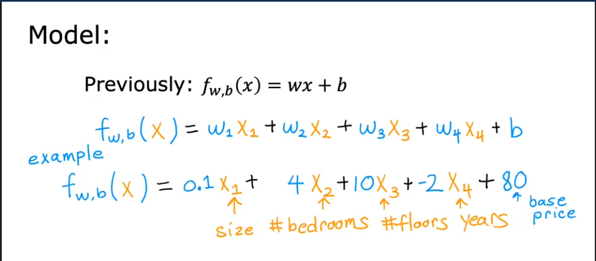
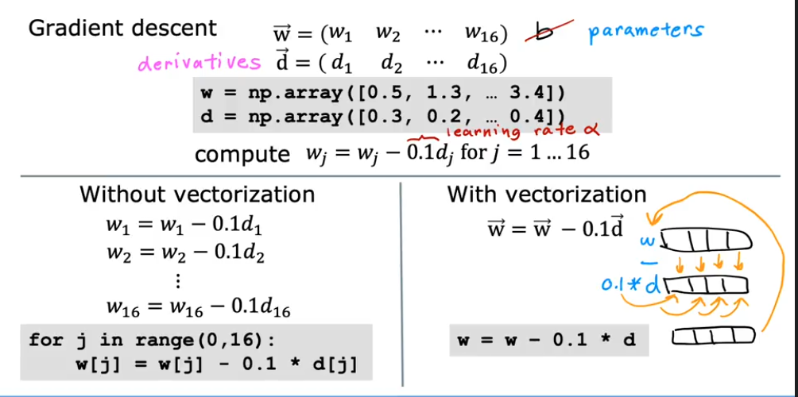
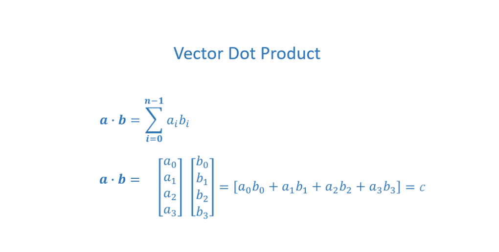

# 🧠 Machine Learning Notes: Multiple Features & Vectorization

This document covers linear regression with multiple input variables, the concept of vectorization for computational efficiency, and a practical guide to the NumPy library for handling vectors and matrices.

---

## 📈 Multiple Features (Variables)

When we move from a single feature to multiple features, our model for linear regression evolves to accommodate them.

### Notation 🔢

Let's define the precise notation for a model with multiple features, as seen in a typical dataset.

*   **m**: The total number of training examples.
*   **n**: The total number of features.
*   **$\vec{x}^{(i)}$**: A vector representing all the feature values of the **i-th training example**. For instance, $\vec{x}^{(2)} = [1416, 3, 2, 40]$.
*   **$x_j^{(i)}$**: The value of the **j-th feature** in the **i-th training example**. For instance, $x_3^{(2)} = 2$, representing the "Number of floors" for the second house.
*   **$\vec{w}$**: The model's parameters (weights or coefficients), represented as a vector `[w₁, w₂, ..., wₙ]`.
*   **b**: The bias term (or intercept).


### Model Representation

Previously, with a single feature, our model was:
$f_{w,b}(x) = wx + b$

Now, with **n** features, the prediction for a single training example $\vec{x}^{(i)}$ is the sum of each feature multiplied by its corresponding weight, plus the bias:

$f_{\vec{w},b}(\vec{x}^{(i)}) = w_1x_1^{(i)} + w_2x_2^{(i)} + w_3x_3^{(i)} + \dots + w_nx_n^{(i)} + b$



This can be expressed more compactly using the **dot product** of the weight vector $\vec{w}$ and the feature vector for a specific example, $\vec{x}^{(i)}$:

$f_{\vec{w},b}(\vec{x}^{(i)}) = \vec{w} \cdot \vec{x}^{(i)} + b$


---

## 🚀 Vectorization

**Vectorization** is the process of rewriting code to use operations on entire arrays (vectors or matrices) at once, rather than iterating through elements one by one. This technique leverages underlying hardware optimizations (like SIMD instructions on CPUs/GPUs) to perform computations much faster.

### Implementation in Python (NumPy)

Let's set up our vectors in Python using the NumPy library:

```python
import numpy as np

# Example parameters
w = np.array([1.0, 2.5, -3.3])
b = 4.0
# A single feature vector x (e.g., x_i)
x = np.array([10, 20, 30])
```

#### Sequential Implementation (Without Vectorization) 🐢

This approach is slower to write and execute. We can calculate the prediction using a `for` loop.

$f_{\vec{w}, b}(\vec{x}) = \sum_{j=1}^{n} (w_j \cdot x_j) + b$

```python
# Slower, loop-based implementation
f = 0
n = w.shape[0]
for j in range(n):
    f = f + w[j] * x[j]
f = f + b

print(f"Prediction (loop): {f}") # Output: 1.0
```

#### Vectorized Implementation (Using NumPy) 🏎️

This version is concise and runs significantly faster because `np.dot()` is highly optimized and executes in parallel.

$f_{\vec{w}, b}(\vec{x}) = \vec{w} \cdot \vec{x} + b$

```python
# Faster, vectorized implementation
f = np.dot(w, x) + b

print(f"Prediction (vectorized): {f}") # Output: 1.0
```

### Recap & Behind the Scenes

Vectorization allows us to perform computations on entire arrays efficiently.


Behind the scenes, modern processors can perform multiple calculations in a single instruction cycle, which is what vectorized libraries like NumPy take advantage of.




---

## 🧪 Lab: A Deep Dive into NumPy

### Understanding "Dimension" 🤔

The term "dimension" can be confusing because it has different meanings in mathematics and in NumPy.

*   **In Mathematics**: A vector's dimension is the number of elements it contains. For example, `[1, 2, 3]` is a 3-dimensional vector.
*   **In NumPy**: A NumPy array's dimension (or `ndim`) refers to the number of **axes** or indices required to access an element.

**Examples:**
*   `a = np.array([10, 20, 30, 40])`
    *   This is a **1-D array** (one axis). You only need one index (e.g., `a[2]`) to access an element.
    *   Its shape is `(4,)`, meaning it has 4 elements.
*   `b = np.array([[1, 2, 3], [4, 5, 6]])`
    *   This is a **2-D array** (two axes: rows and columns). You need two indices (e.g., `b[1, 2]`) to access an element.
    *   Its shape is `(2, 3)`, meaning it has 2 rows and 3 columns.
*   A scalar (a single number) in NumPy has 0 dimensions, and its shape is an empty tuple `()`.

#### Key Distinction: `shape(n,)` vs `shape(n, 1)`

This is a crucial concept in NumPy:
*   **`shape(n,)`**: A 1-D array (a "rank-1" array or flat vector) with `n` elements.
*   **`shape(n, 1)`**: A 2-D array (a matrix) with `n` rows and 1 column.

### Vector Operations

#### Vector Creation

```python
# Routines that accept a shape tuple
a = np.zeros(4);                print(f"np.zeros(4) :   a = {a}, a shape = {a.shape}, a data type = {a.dtype}")
a = np.zeros((4,));             print(f"np.zeros((4,)) :  a = {a}, a shape = {a.shape}, a data type = {a.dtype}")
a = np.random.random_sample(4); print(f"np.random.random_sample(4): a = {a}, a shape = {a.shape}")

# Routines that do not accept a shape tuple
a = np.arange(4.);              print(f"np.arange(4.):     a = {a}, a shape = {a.shape}")
a = np.random.rand(4);          print(f"np.random.rand(4): a = {a}, a shape = {a.shape}")

# Creating from a Python list
a = np.array([5,4,3,2]);  print(f"np.array([5,4,3,2]):  a = {a}, a shape = {a.shape}")
a = np.array([5.,4,3,2]); print(f"np.array([5.,4,3,2]): a = {a}, a shape = {a.shape}") # Note the float type
```
**Output:**
```
np.zeros(4) :   a = [0. 0. 0. 0.], a shape = (4,), a data type = float64
np.zeros((4,)) :  a = [0. 0. 0. 0.], a shape = (4,), a data type = float64
np.random.random_sample(4): a = [0.22685121 0.55131477 0.44308805 0.43354935], a shape = (4,)
np.arange(4.):     a = [0. 1. 2. 3.], a shape = (4,)
np.random.rand(4): a = [0.65236249 0.98229432 0.79373678 0.8313333 ], a shape = (4,)
np.array([5,4,3,2]):  a = [5 4 3 2], a shape = (4,)
np.array([5.,4,3,2]): a = [5. 4. 3. 2.], a shape = (4,)
```

#### Indexing
Accessing elements by their position.

```python
a = np.arange(10)
print(f"Original vector: {a}")

# Access a single element (returns a scalar)
print(f"a[2] = {a[2]}, shape: {a[2].shape}")

# Access the last element
print(f"a[-1] = {a[-1]}")

# Trying to access an out-of-bounds index will raise an error
try:
    c = a[10]
except Exception as e:
    print(f"\nError message: {e}")
```
**Output:**
```
Original vector: [0 1 2 3 4 5 6 7 8 9]
a[2] = 2, shape: ()
a[-1] = 9

Error message: index 10 is out of bounds for axis 0 with size 10
```

#### Slicing
Extracting a subset of elements. The syntax is `start:stop:step`.

```python
a = np.arange(10)
print(f"a = {a}")

# Slice from index 2 up to (but not including) 7
c = a[2:7:1]; print(f"a[2:7:1] = {c}")

# Slice from index 2 to 7, with a step of 2
c = a[2:7:2]; print(f"a[2:7:2] = {c}")

# Slice from index 3 to the end
c = a[3:];    print(f"a[3:]    = {c}")

# Slice from the beginning up to index 3
c = a[:3];    print(f"a[:3]    = {c}")

# Slice the entire vector (creates a copy)
c = a[:];     print(f"a[:]     = {c}")
```
**Output:**
```
a = [0 1 2 3 4 5 6 7 8 9]
a[2:7:1] = [2 3 4 5 6]
a[2:7:2] = [2 4 6]
a[3:]    = [3 4 5 6 7 8 9]
a[:3]    = [0 1 2]
a[:]     = [0 1 2 3 4 5 6 7 8 9]
```

#### Single Vector Operations
Operations applied to each element of a single vector.

```python
a = np.array([1, 2, 3, 4])
print(f"a           : {a}")
print(f"-a          : {-a}")         # Negation
print(f"np.sum(a)   : {np.sum(a)}")   # Summation
print(f"np.mean(a)  : {np.mean(a)}")  # Mean
print(f"a**2        : {a**2}")        # Element-wise square
```
**Output:**
```
a           : [1 2 3 4]
-a          : [-1 -2 -3 -4]
np.sum(a)   : 10
np.mean(a)  : 2.5
a**2        : [ 1  4  9 16]
```

#### Vector-Vector Element-wise Operations
Arithmetic operations between two vectors of the **same size**.

```python
a = np.array([1, 2, 3, 4])
b = np.array([-1, -2, 3, 4])
print(f"a + b = {a + b}")

# Mismatched shapes will cause an error
c = np.array([1, 2])
try:
    d = a + c
except Exception as e:
    print(f"\nError: {e}")
```
**Output:**
```
a + b = [0 0 6 8]

Error: operands could not be broadcast together with shapes (4,) (2,)
```

#### Scalar-Vector Operations
An operation between a scalar and each element of a vector.

```python
a = np.array([1, 2, 3, 4])
b = 5 * a
print(f"5 * a = {b}")
```
**Output:**
```
5 * a = [ 5 10 15 20]
```

#### Vector-Vector Dot Product
The dot product multiplies corresponding elements of two vectors and sums the results, producing a single scalar value. The vectors must have the same number of elements.


```python
a = np.array([1, 2, 3, 4])
b = np.array([-1, 4, 3, 2])

# Using the highly optimized np.dot function
c = np.dot(a, b)
print(f"np.dot(a, b) = {c}, shape = {c.shape}") # Result is a scalar

# Dot product is commutative: np.dot(a, b) == np.dot(b, a)
print(f"np.dot(b, a) = {np.dot(b, a)}")
```
**Output:**
```
np.dot(a, b) = 24, shape = ()
np.dot(b, a) = 24
```

### The Need for Speed: Vectorization vs. Loops ⚡

A demonstration of the performance gain from vectorization on large arrays.

```python
import time

np.random.seed(1)
a = np.random.rand(10000000)  # 10 million elements
b = np.random.rand(10000000)

# Vectorized version
tic = time.time()
c = np.dot(a, b)
toc = time.time()
print(f"np.dot(a, b) = {c:.4f}")
print(f"Vectorized version duration: {1000*(toc-tic):.4f} ms")

# Custom loop-based version
def my_dot(a, b):
    x = 0
    for i in range(a.shape[0]):
        x = x + a[i] * b[i]
    return x

tic = time.time()
c = my_dot(a,b)
toc = time.time()
print(f"\nmy_dot(a, b) = {c:.4f}")
print(f"Loop version duration: {1000*(toc-tic):.4f} ms")
```
**Output (will vary based on hardware):**
```
np.dot(a, b) = 2501072.5817
Vectorized version duration: 14.8320 ms

my_dot(a, b) = 2501072.5817
Loop version duration: 2154.6719 ms
```
As shown, vectorization offers a massive speed-up by using optimized, parallelized hardware instructions.

### Note on Course Notation

In this course, our training data `X_train` will often be a 2-D array (matrix) of shape `(m, n)`, where `m` is the number of training examples and `n` is the number of features. When we process it example-by-example, we will index a single row, e.g., `X[i]`. This operation `X[i]` returns a **1-D vector** of shape `(n,)`.

### Matrix Operations

#### Matrix Creation

```python
# Create matrices of specified shapes, filled with values
a = np.zeros((2, 3))
print(f"a = {a}, shape = {a.shape}")

a = np.random.random_sample((2, 2))
print(f"a = {a}, shape = {a.shape}")

# Create from a nested Python list
a = np.array([[5, 4, 3], [2, 1, 0]])
print(f"a = {a}, shape = {a.shape}")
```
**Output:**
```
a = [[0. 0. 0.]
 [0. 0. 0.]], shape = (2, 3)
a = [[0.69827992 0.39517174]
 [0.4504233  0.33053948]], shape = (2, 2)
a = [[5 4 3]
 [2 1 0]], shape = (2, 3)
```

#### Indexing
To access elements in a 2-D array, use `[row, column]`.

```python
# Reshape a 1-D array into a 3x2 matrix
a = np.arange(6).reshape(3, 2)
print(f"a = \n{a}")

# Access a single element (returns a scalar)
print(f"\na[2, 0] = {a[2, 0]}")

# Access an entire row (returns a 1-D vector)
print(f"a[2] = {a[2]}, shape = {a[2].shape}")
```
**Output:**
```
a =
[[0 1]
 [2 3]
 [4 5]]

a[2, 0] = 4
a[2] = [4 5], shape = (2,)
```

#### Slicing
Slicing works on matrices too, using `[row_slice, column_slice]`.

```python
a = np.arange(20).reshape(2, 10)
print(f"a = \n{a}")

# Slice columns 2 through 6 from the first row (row 0)
print(f"\na[0, 2:7:1] = {a[0, 2:7:1]}")

# Slice columns 2 through 6 from ALL rows
print(f"\na[:, 2:7:1] = \n{a[:, 2:7:1]}")

# Slice a full row (very common)
print(f"\na[1,:] = {a[1,:]}")
print(f"a[1]   = {a[1]}") # Same result
```
**Output:**
```
a =
[[ 0  1  2  3  4  5  6  7  8  9]
 [10 11 12 13 14 15 16 17 18 19]]

a[0, 2:7:1] = [2 3 4 5 6]

a[:, 2:7:1] =
[[ 2  3  4  5  6]
 [12 13 14 15 16]]

a[1,:] = [10 11 12 13 14 15 16 17 18 19]
a[1]   = [10 11 12 13 14 15 16 17 18 19]
```

---

## 📉 Gradient Descent for Multiple Linear Regression

The algorithm for gradient descent remains the same, but the implementation now uses vector operations.

### Algorithm with Vector Notation

The update rules for the parameters are applied simultaneously for all `j = 1, ..., n`.


### The Derivative Term

The partial derivatives are calculated as follows for each weight $w_j$:


---

## ⚖️ An Alternative to Gradient Descent

### Normal Equation

The Normal Equation is an analytical, non-iterative method for finding the optimal values of $\vec{w}$ and $b$ for linear regression.

#### Advantages ✅
*   No need to choose a learning rate ($\alpha$).
*   No iterations are needed; it provides a direct solution.

#### Disadvantages ❌
*   It does **not** generalize to other learning algorithms (like logistic regression).
*   It can be computationally slow when the number of features (`n`) is very large (e.g., n > 10,000), due to the need to compute a matrix inverse, which is an $O(n^3)$ operation.
