# 🧠 Machine Learning Notes: Multiple Features & Vectorization

This document covers linear regression with multiple input variables, the concept of vectorization for computational efficiency, a practical guide to the NumPy library, and a hands-on lab implementation.

## 📜 Table of Contents
- [📈 Multiple Features (Variables)](#multiple-features-variables)
  - [Notation 🔢](#notation)
  - [Model Representation](#model-representation)
- [🚀 Vectorization](#vectorization)
  - [Implementation in Python (NumPy)](#implementation-in-python-numpy)
  - [Recap & Behind the Scenes](#recap--behind-the-scenes)
- [🧪 Lab: A Deep Dive into NumPy](#lab-a-deep-dive-into-numpy)
  - [Understanding "Dimension" 🤔](#understanding-dimension)
  - [Vector Operations](#vector-operations)
  - [The Need for Speed: Vectorization vs. Loops ⚡](#the-need-for-speed-vectorization-vs-loops)
  - [Note on Course Notation](#note-on-course-notation)
  - [Matrix Operations](#matrix-operations)
- [📉 Gradient Descent for Multiple Linear Regression](#gradient-descent-for-multiple-linear-regression)
  - [Algorithm with Vector Notation](#algorithm-with-vector-notation)
  - [The Derivative Term](#the-derivative-term)
- [⚖️ An Alternative to Gradient Descent](#an-alternative-to-gradient-descent)
  - [Normal Equation](#normal-equation)
- [💻 Lab: Multiple Variable Linear Regression](#lab-multiple-variable-linear-regression)
  - [Lab Notation](#lab-notation)
  - [Initial Data and Parameters](#initial-data-and-parameters)
  - [Model Prediction with Multiple Variables](#model-prediction-with-multiple-variables)
  - [Cost Function for Multiple Variables](#cost-function-for-multiple-variables)
  - [Gradient Calculation for Multiple Variables](#gradient-calculation-for-multiple-variables)
  - [Gradient Descent with Multiple Variables](#gradient-descent-with-multiple-variables)
  - [Visualizing the Results 📊](#visualizing-the-results)

---

## 📈 Multiple Features (Variables)

When we move from a single feature to multiple features, our model for linear regression evolves to accommodate them.

### Notation 🔢

Let's define the precise notation for a model with multiple features, as seen in a typical dataset.

*   **m**: The total number of training examples.
*   **n**: The total number of features.
*   **$\vec{x}^{(i)}$**: A vector representing all the feature values of the **i-th training example**. For instance, $\vec{x}^{(2)} = [1416, 3, 2, 40]$.
*   **$x_j^{(i)}$**: The value of the **j-th feature** in the **i-th training example**. For instance, $x_3^{(2)} = 2$, representing the "Number of floors" for the second house.
*   **$\vec{w}$**: The model's parameters (weights or coefficients), represented as a vector `[w₁, w₂, ..., wₙ]`.
*   **b**: The bias term (or intercept).

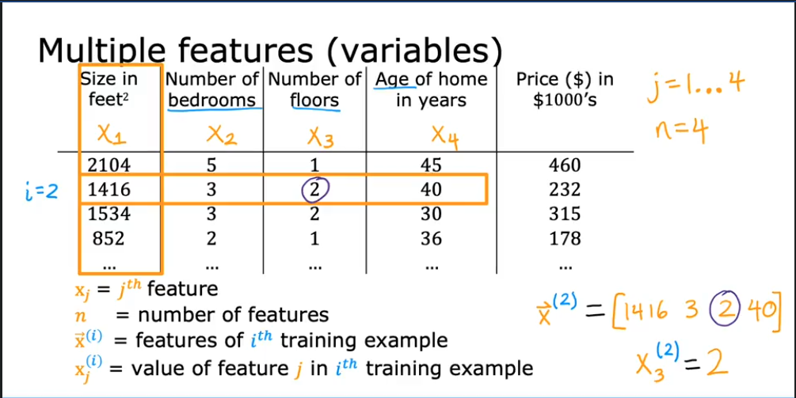

### Model Representation

Previously, with a single feature, our model was:
$f_{w,b}(x) = wx + b$

Now, with **n** features, the prediction for a single training example $\vec{x}^{(i)}$ is the sum of each feature multiplied by its corresponding weight, plus the bias:

$f_{\vec{w},b}(\vec{x}^{(i)}) = w_1x_1^{(i)} + w_2x_2^{(i)} + w_3x_3^{(i)} + \dots + w_nx_n^{(i)} + b$

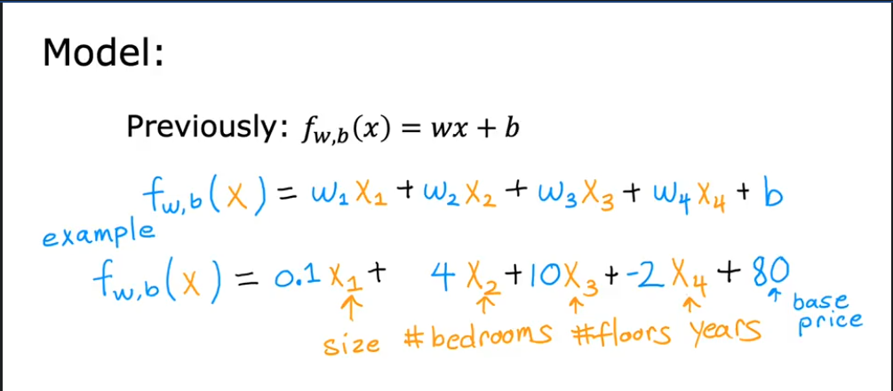

This can be expressed more compactly using the **dot product** of the weight vector $\vec{w}$ and the feature vector for a specific example, $\vec{x}^{(i)}$:

$f_{\vec{w},b}(\vec{x}^{(i)}) = \vec{w} \cdot \vec{x}^{(i)} + b$

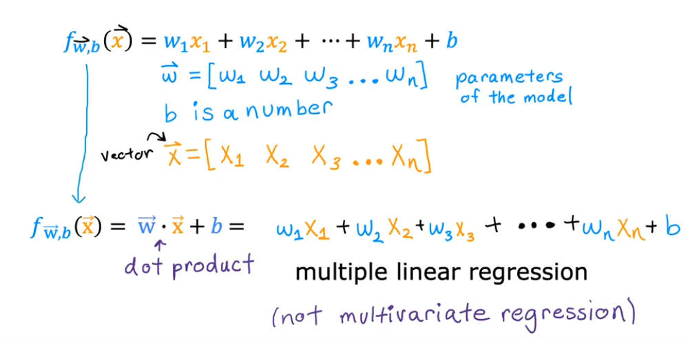

---

## 🚀 Vectorization

**Vectorization** is the process of rewriting code to use operations on entire arrays (vectors or matrices) at once, rather than iterating through elements one by one. This technique leverages underlying hardware optimizations (like SIMD instructions on CPUs/GPUs) to perform computations much faster.

### Implementation in Python (NumPy)

Let's set up our vectors in Python using the NumPy library:

```python
import numpy as np

# Example parameters
w = np.array([1.0, 2.5, -3.3])
b = 4.0
# A single feature vector x (e.g., x_i)
x = np.array([10, 20, 30])
```

#### Sequential Implementation (Without Vectorization) 🐢

This approach is slower to write and execute. We can calculate the prediction using a `for` loop.

$f_{\vec{w}, b}(\vec{x}) = \sum_{j=1}^{n} (w_j \cdot x_j) + b$

```python
# Slower, loop-based implementation
f = 0
n = w.shape[0]
for j in range(n):
    f = f + w[j] * x[j]
f = f + b

print(f"Prediction (loop): {f}") # Output: 1.0
```

#### Vectorized Implementation (Using NumPy) 🏎️

This version is concise and runs significantly faster because `np.dot()` is highly optimized and executes in parallel.

$f_{\vec{w}, b}(\vec{x}) = \vec{w} \cdot \vec{x} + b$

```python
# Faster, vectorized implementation
f = np.dot(w, x) + b

print(f"Prediction (vectorized): {f}") # Output: 1.0
```

### Recap & Behind the Scenes

Vectorization allows us to perform computations on entire arrays efficiently.

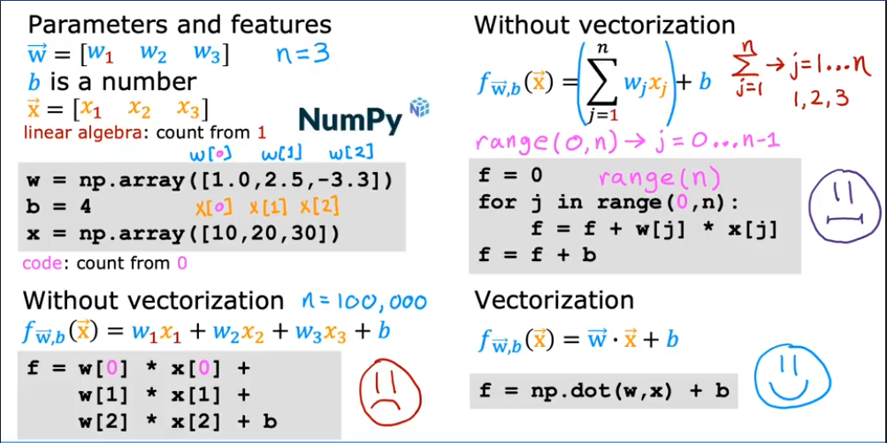

Behind the scenes, modern processors can perform multiple calculations in a single instruction cycle, which is what vectorized libraries like NumPy take advantage of.

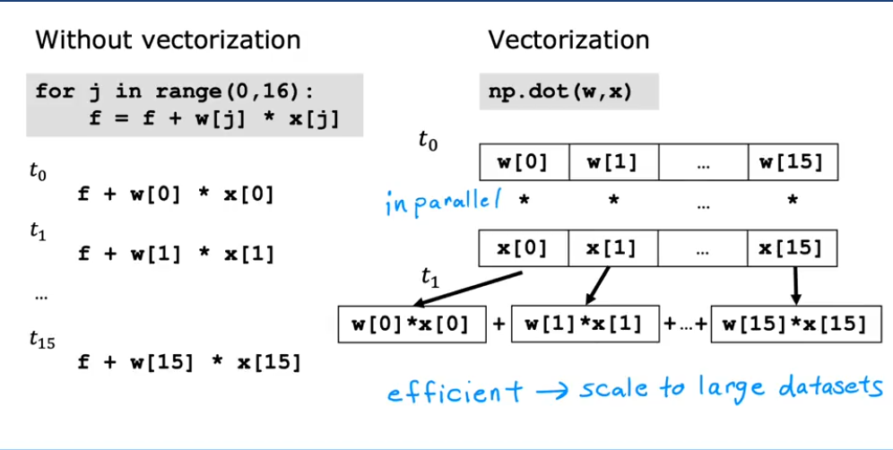
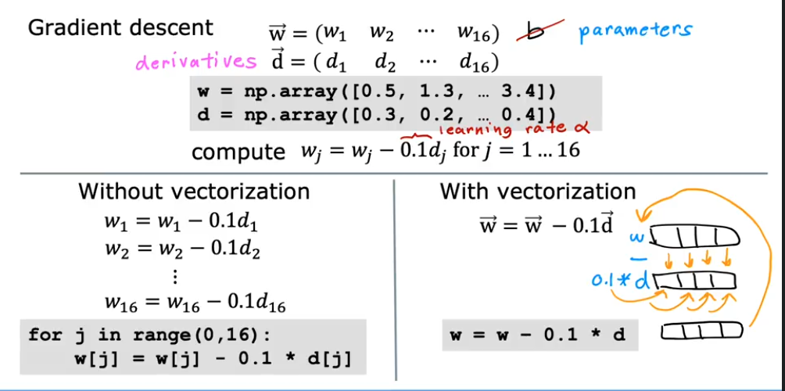

---

## 🧪 Lab: A Deep Dive into NumPy

### Understanding "Dimension" 🤔

The term "dimension" can be confusing because it has different meanings in mathematics and in NumPy.

*   **In Mathematics**: A vector's dimension is the number of elements it contains. For example, `[1, 2, 3]` is a 3-dimensional vector.
*   **In NumPy**: A NumPy array's dimension (or `ndim`) refers to the number of **axes** or indices required to access an element.

**Examples:**
*   `a = np.array([10, 20, 30, 40])`
    *   This is a **1-D array** (one axis). You only need one index (e.g., `a[2]`) to access an element.
    *   Its shape is `(4,)`, meaning it has 4 elements.
*   `b = np.array([[1, 2, 3], [4, 5, 6]])`
    *   This is a **2-D array** (two axes: rows and columns). You need two indices (e.g., `b[1, 2]`) to access an element.
    *   Its shape is `(2, 3)`, meaning it has 2 rows and 3 columns.
*   A scalar (a single number) in NumPy has 0 dimensions, and its shape is an empty tuple `()`.

#### Key Distinction: `shape(n,)` vs `shape(n, 1)`

This is a crucial concept in NumPy:
*   **`shape(n,)`**: A 1-D array (a "rank-1" array or flat vector) with `n` elements.
*   **`shape(n, 1)`**: A 2-D array (a matrix) with `n` rows and 1 column.

### Vector Operations

#### Vector Creation

```python
# Routines that accept a shape tuple
a = np.zeros(4);                print(f"np.zeros(4) :   a = {a}, a shape = {a.shape}, a data type = {a.dtype}")
a = np.zeros((4,));             print(f"np.zeros((4,)) :  a = {a}, a shape = {a.shape}, a data type = {a.dtype}")
a = np.random.random_sample(4); print(f"np.random.random_sample(4): a = {a}, a shape = {a.shape}")

# Routines that do not accept a shape tuple
a = np.arange(4.);              print(f"np.arange(4.):     a = {a}, a shape = {a.shape}")
a = np.random.rand(4);          print(f"np.random.rand(4): a = {a}, a shape = {a.shape}")

# Creating from a Python list
a = np.array([5,4,3,2]);  print(f"np.array([5,4,3,2]):  a = {a}, a shape = {a.shape}")
a = np.array([5.,4,3,2]); print(f"np.array([5.,4,3,2]): a = {a}, a shape = {a.shape}") # Note the float type
```
**Output:**
```
np.zeros(4) :   a = [0. 0. 0. 0.], a shape = (4,), a data type = float64
np.zeros((4,)) :  a = [0. 0. 0. 0.], a shape = (4,), a data type = float64
np.random.random_sample(4): a = [0.22685121 0.55131477 0.44308805 0.43354935], a shape = (4,)
np.arange(4.):     a = [0. 1. 2. 3.], a shape = (4,)
np.random.rand(4): a = [0.65236249 0.98229432 0.79373678 0.8313333 ], a shape = (4,)
np.array([5,4,3,2]):  a = [5 4 3 2], a shape = (4,)
np.array([5.,4,3,2]): a = [5. 4. 3. 2.], a shape = (4,)
```

#### Indexing
Accessing elements by their position.

```python
a = np.arange(10)
print(f"Original vector: {a}")

# Access a single element (returns a scalar)
print(f"a[2] = {a[2]}, shape: {a[2].shape}")

# Access the last element
print(f"a[-1] = {a[-1]}")

# Trying to access an out-of-bounds index will raise an error
try:
    c = a[10]
except Exception as e:
    print(f"\nError message: {e}")
```
**Output:**
```
Original vector: [0 1 2 3 4 5 6 7 8 9]
a[2] = 2, shape: ()
a[-1] = 9

Error message: index 10 is out of bounds for axis 0 with size 10
```

#### Slicing
Extracting a subset of elements. The syntax is `start:stop:step`.

```python
a = np.arange(10)
print(f"a = {a}")

# Slice from index 2 up to (but not including) 7
c = a[2:7:1]; print(f"a[2:7:1] = {c}")

# Slice from index 2 to 7, with a step of 2
c = a[2:7:2]; print(f"a[2:7:2] = {c}")

# Slice from index 3 to the end
c = a[3:];    print(f"a[3:]    = {c}")

# Slice from the beginning up to index 3
c = a[:3];    print(f"a[:3]    = {c}")

# Slice the entire vector (creates a copy)
c = a[:];     print(f"a[:]     = {c}")
```
**Output:**
```
a = [0 1 2 3 4 5 6 7 8 9]
a[2:7:1] = [2 3 4 5 6]
a[2:7:2] = [2 4 6]
a[3:]    = [3 4 5 6 7 8 9]
a[:3]    = [0 1 2]
a[:]     = [0 1 2 3 4 5 6 7 8 9]
```

#### Single Vector Operations
Operations applied to each element of a single vector.

```python
a = np.array([1, 2, 3, 4])
print(f"a           : {a}")
print(f"-a          : {-a}")         # Negation
print(f"np.sum(a)   : {np.sum(a)}")   # Summation
print(f"np.mean(a)  : {np.mean(a)}")  # Mean
print(f"a**2        : {a**2}")        # Element-wise square
```
**Output:**
```
a           : [1 2 3 4]
-a          : [-1 -2 -3 -4]
np.sum(a)   : 10
np.mean(a)  : 2.5
a**2        : [ 1  4  9 16]
```

#### Vector-Vector Element-wise Operations
Arithmetic operations between two vectors of the **same size**.

```python
a = np.array([1, 2, 3, 4])
b = np.array([-1, -2, 3, 4])
print(f"a + b = {a + b}")

# Mismatched shapes will cause an error
c = np.array([1, 2])
try:
    d = a + c
except Exception as e:
    print(f"\nError: {e}")
```
**Output:**
```
a + b = [0 0 6 8]

Error: operands could not be broadcast together with shapes (4,) (2,)
```

#### Scalar-Vector Operations
An operation between a scalar and each element of a vector.

```python
a = np.array([1, 2, 3, 4])
b = 5 * a
print(f"5 * a = {b}")
```
**Output:**
```
5 * a = [ 5 10 15 20]
```

#### Vector-Vector Dot Product
The dot product multiplies corresponding elements of two vectors and sums the results, producing a single scalar value. The vectors must have the same number of elements.
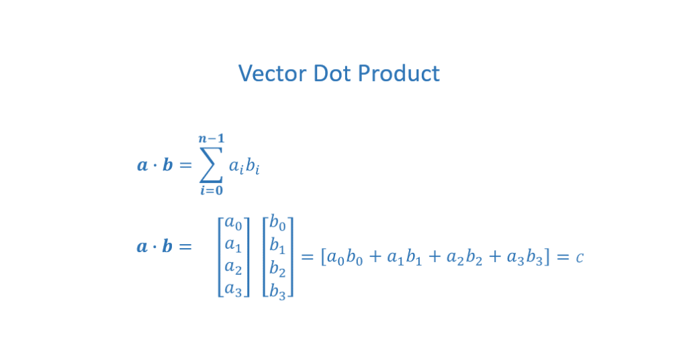

```python
a = np.array([1, 2, 3, 4])
b = np.array([-1, 4, 3, 2])

# Using the highly optimized np.dot function
c = np.dot(a, b)
print(f"np.dot(a, b) = {c}, shape = {c.shape}") # Result is a scalar

# Dot product is commutative: np.dot(a, b) == np.dot(b, a)
print(f"np.dot(b, a) = {np.dot(b, a)}")
```
**Output:**
```
np.dot(a, b) = 24, shape = ()
np.dot(b, a) = 24
```

### The Need for Speed: Vectorization vs. Loops ⚡

A demonstration of the performance gain from vectorization on large arrays.

```python
import time

np.random.seed(1)
a = np.random.rand(10000000)  # 10 million elements
b = np.random.rand(10000000)

# Vectorized version
tic = time.time()
c = np.dot(a, b)
toc = time.time()
print(f"np.dot(a, b) = {c:.4f}")
print(f"Vectorized version duration: {1000*(toc-tic):.4f} ms")

# Custom loop-based version
def my_dot(a, b):
    x = 0
    for i in range(a.shape[0]):
        x = x + a[i] * b[i]
    return x

tic = time.time()
c = my_dot(a,b)
toc = time.time()
print(f"\nmy_dot(a, b) = {c:.4f}")
print(f"Loop version duration: {1000*(toc-tic):.4f} ms")
```
**Output (will vary based on hardware):**
```
np.dot(a, b) = 2501072.5817
Vectorized version duration: 14.8320 ms

my_dot(a, b) = 2501072.5817
Loop version duration: 2154.6719 ms
```
As shown, vectorization offers a massive speed-up by using optimized, parallelized hardware instructions.

### Note on Course Notation

In this course, our training data `X_train` will often be a 2-D array (matrix) of shape `(m, n)`, where `m` is the number of training examples and `n` is the number of features. When we process it example-by-example, we will index a single row, e.g., `X[i]`. This operation `X[i]` returns a **1-D vector** of shape `(n,)`.

### Matrix Operations

#### Matrix Creation

```python
# Create matrices of specified shapes, filled with values
a = np.zeros((2, 3))
print(f"a = {a}, shape = {a.shape}")

a = np.random.random_sample((2, 2))
print(f"a = {a}, shape = {a.shape}")

# Create from a nested Python list
a = np.array([[5, 4, 3], [2, 1, 0]])
print(f"a = {a}, shape = {a.shape}")
```
**Output:**
```
a = [[0. 0. 0.]
 [0. 0. 0.]], shape = (2, 3)
a = [[0.69827992 0.39517174]
 [0.4504233  0.33053948]], shape = (2, 2)
a = [[5 4 3]
 [2 1 0]], shape = (2, 3)
```

#### Indexing
To access elements in a 2-D array, use `[row, column]`.

```python
# Reshape a 1-D array into a 3x2 matrix
a = np.arange(6).reshape(3, 2)
print(f"a = \n{a}")

# Access a single element (returns a scalar)
print(f"\na[2, 0] = {a[2, 0]}")

# Access an entire row (returns a 1-D vector)
print(f"a[2] = {a[2]}, shape = {a[2].shape}")
```
**Output:**
```
a =
[[0 1]
 [2 3]
 [4 5]]

a[2, 0] = 4
a[2] = [4 5], shape = (2,)
```

#### Slicing
Slicing works on matrices too, using `[row_slice, column_slice]`.

```python
a = np.arange(20).reshape(2, 10)
print(f"a = \n{a}")

# Slice columns 2 through 6 from the first row (row 0)
print(f"\na[0, 2:7:1] = {a[0, 2:7:1]}")

# Slice columns 2 through 6 from ALL rows
print(f"\na[:, 2:7:1] = \n{a[:, 2:7:1]}")

# Slice a full row (very common)
print(f"\na[1,:] = {a[1,:]}")
print(f"a[1]   = {a[1]}") # Same result
```
**Output:**
```
a =
[[ 0  1  2  3  4  5  6  7  8  9]
 [10 11 12 13 14 15 16 17 18 19]]

a[0, 2:7:1] = [2 3 4 5 6]

a[:, 2:7:1] =
[[ 2  3  4  5  6]
 [12 13 14 15 16]]

a[1,:] = [10 11 12 13 14 15 16 17 18 19]
a[1]   = [10 11 12 13 14 15 16 17 18 19]
```

---

## 📉 Gradient Descent for Multiple Linear Regression

The algorithm for gradient descent remains the same, but the implementation now uses vector operations.

### Algorithm with Vector Notation

The update rules for the parameters are applied simultaneously for all `j = 1, ..., n`.

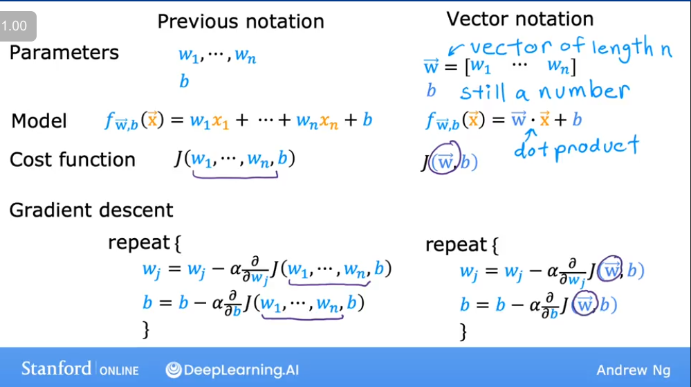

### The Derivative Term

The partial derivatives are calculated as follows for each weight $w_j$:

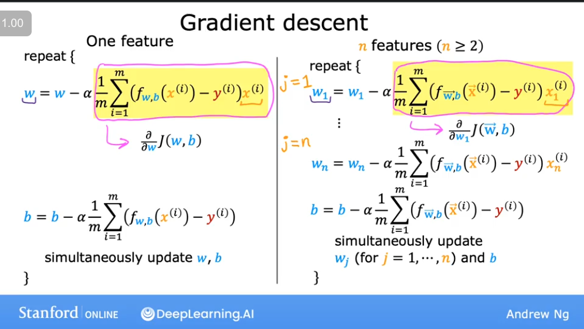

---

## ⚖️ An Alternative to Gradient Descent

### Normal Equation

The Normal Equation is an analytical, non-iterative method for finding the optimal values of $\vec{w}$ and $b$ for linear regression.

#### Advantages ✅
*   No need to choose a learning rate ($\alpha$).
*   No iterations are needed; it provides a direct solution.

#### Disadvantages ❌
*   It does **not** generalize to other learning algorithms (like logistic regression).
*   It can be computationally slow when the number of features (`n`) is very large (e.g., n > 10,000), due to the need to compute a matrix inverse, which is an $O(n^3)$ operation.

---

## 💻 Lab: Multiple Variable Linear Regression

Let's apply the concepts above in a practical lab setting.

### Lab Notation

The notation used in the lab is consistent with the theory discussed.

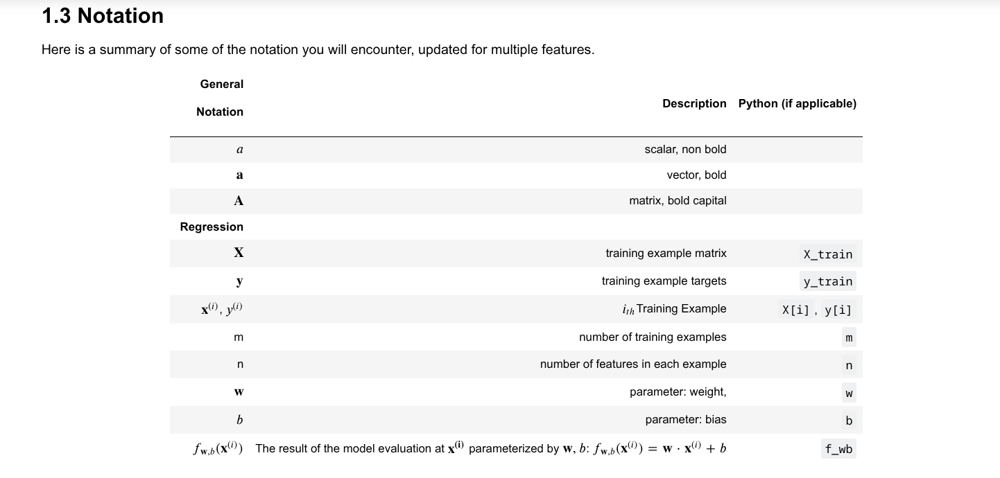

### Initial Data and Parameters

First, we set up our training data and initial parameters.

```python
import copy, math
import numpy as np
import matplotlib.pyplot as plt

# Using a predefined style for plots
plt.style.use('./deeplearning.mplstyle')
# Set print options for NumPy arrays for better readability
np.set_printoptions(precision=2)

# Training data
X_train = np.array([[2104, 5, 1, 45], [1416, 3, 2, 40], [852, 2, 1, 35]])
y_train = np.array([460, 232, 178])
```
The `X_train` matrix has 3 examples (rows) and 4 features (columns).

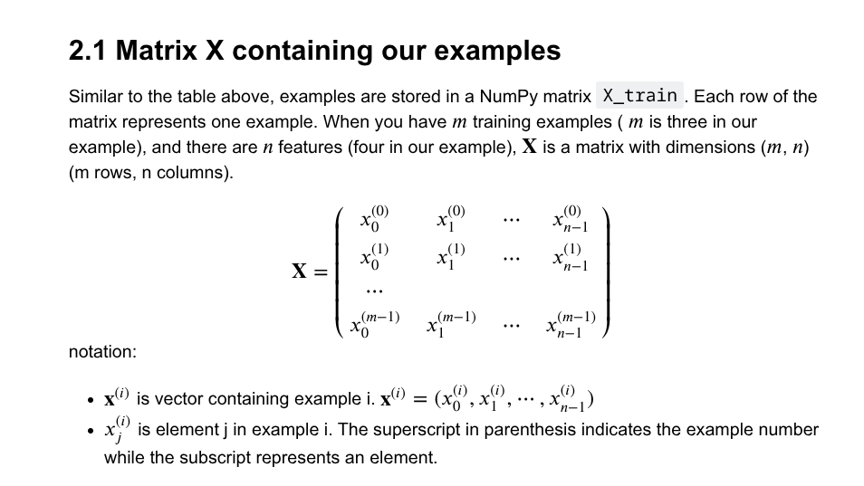

```python
# Check the shapes and types of our data
print(f"X Shape: {X_train.shape}, X Type: {type(X_train)}")
print(X_train)
print(f"\ny Shape: {y_train.shape}, y Type: {type(y_train)}")
print(y_train)
```
**Output:**
```
X Shape: (3, 4), X Type: <class 'numpy.ndarray'>
[[2104    5    1   45]
 [1416    3    2   40]
 [ 852    2    1   35]]

y Shape: (3,), y Type: <class 'numpy.ndarray'>
[460 232 178]
```

We also initialize the parameters $\vec{w}$ (a vector) and $b$ (a scalar).

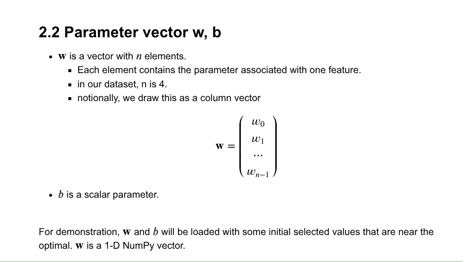

```python
# Initial parameters (these are pre-calculated optimal values for demonstration)
b_init = 785.1811367994083
w_init = np.array([ 0.39133535, 18.75376741, -53.36032453, -26.42131618])
print(f"w_init shape: {w_init.shape}, b_init type: {type(b_init)}")
```
**Output:**
```
w_init shape: (4,), b_init type: <class 'float'>
```

### Model Prediction with Multiple Variables

The model's prediction is given by the linear equation:
> **Edit**: Converted the formula below from plain text to LaTeX for better readability and mathematical correctness.

$f_{\vec{w},b}(\vec{x}) = w_0x_0 + w_1x_1 + \dots + w_{n-1}x_{n-1} + b$

or in vector notation:

$f_{\vec{w},b}(\vec{x}) = \vec{w} \cdot \vec{x} + b$

Let's implement this both with a loop and with vectorization.

#### Single Prediction (Element-by-Element)

```python
def predict_single_loop(x, w, b):
    """
    Calculates a single prediction using a for loop.

    Args:
      x (ndarray): Shape (n,) example with multiple features
      w (ndarray): Shape (n,) model parameters
      b (scalar):  model parameter

    Returns:
      p (scalar):  prediction
    """
    n = x.shape[0]
    p = 0
    for i in range(n):
        p_i = x[i] * w[i]
        p = p + p_i
    p = p + b
    return p

# Get the first training example
x_vec = X_train[0,:]
print(f"x_vec shape {x_vec.shape}, x_vec value: {x_vec}")

# Make a prediction using the loop-based function
f_wb = predict_single_loop(x_vec, w_init, b_init)
print(f"f_wb shape {f_wb.shape}, prediction: {f_wb}")
```
**Output:**
```
x_vec shape (4,), x_vec value: [2104    5    1   45]
f_wb shape (), prediction: 459.9999976194083
```

#### Single Prediction (Vectorized)

```python
def predict(x, w, b):
    """
    Calculates a single prediction using vectorization (np.dot).

    Args:
      x (ndarray): Shape (n,) example with multiple features
      w (ndarray): Shape (n,) model parameters
      b (scalar):  model parameter

    Returns:
      p (scalar):  prediction
    """
    p = np.dot(x, w) + b
    return p

# Get the first training example
x_vec = X_train[0,:]
print(f"x_vec shape {x_vec.shape}, x_vec value: {x_vec}")

# Make a prediction using the vectorized function
f_wb = predict(x_vec, w_init, b_init)
print(f"f_wb shape {f_wb.shape}, prediction: {f_wb}")
```
**Output:**
```
x_vec shape (4,), x_vec value: [2104    5    1   45]
f_wb shape (), prediction: 459.99999761940825
```

### Cost Function for Multiple Variables

The cost function remains the same as for single-variable regression, but now the prediction $f_{\vec{w},b}(\vec{x}^{(i)})$ involves multiple features.

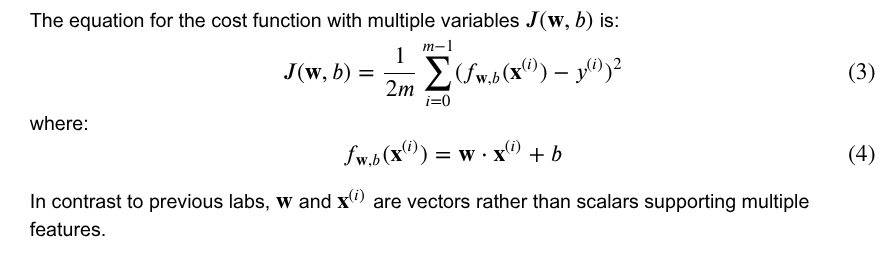

```python
def compute_cost(X, y, w, b):
    """
    Computes the cost function for linear regression.

    Args:
      X (ndarray (m,n)): Data, m examples with n features
      y (ndarray (m,)) : target values
      w (ndarray (n,)) : model parameters
      b (scalar)       : model parameter

    Returns:
      cost (scalar): cost
    """
    m = X.shape[0]
    cost = 0.0
    for i in range(m):
        f_wb_i = np.dot(X[i], w) + b
        cost = cost + (f_wb_i - y[i])**2
    cost = cost / (2 * m)
    return cost

# Compute and display cost using our pre-chosen optimal parameters.
cost = compute_cost(X_train, y_train, w_init, b_init)
print(f'Cost at optimal w : {cost}')
```
**Output:**
```
Cost at optimal w : 1.5578904880036537e-12
```

### Gradient Calculation for Multiple Variables
The gradient calculation involves finding the partial derivatives of the cost function with respect to each parameter ($b$ and each $w_j$).

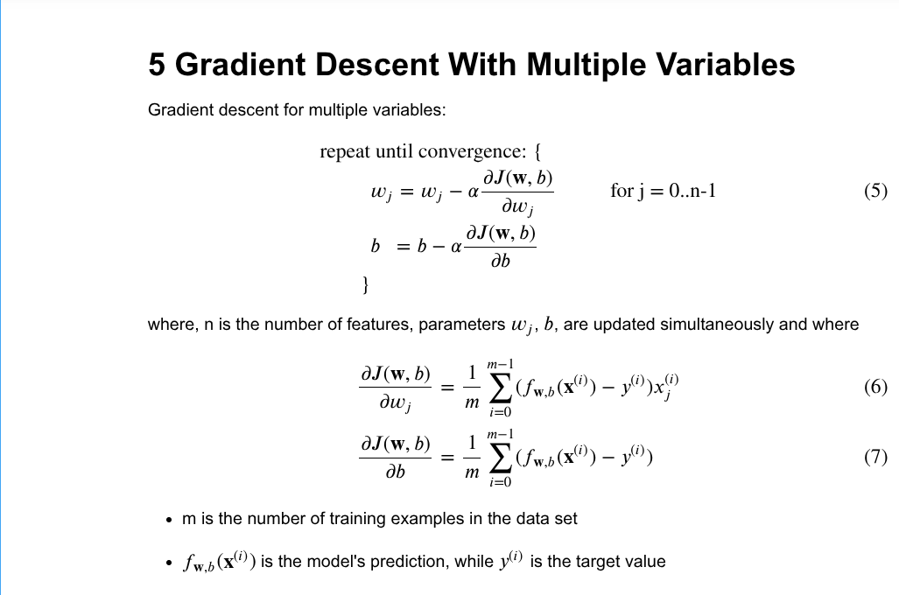
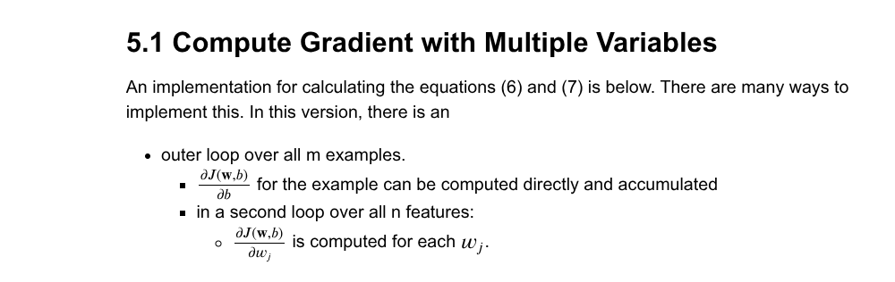

```python
def compute_gradient(X, y, w, b):
    """
    Computes the gradient for linear regression.

    Args:
      X (ndarray (m,n)): Data, m examples with n features
      y (ndarray (m,)) : target values
      w (ndarray (n,)) : model parameters
      b (scalar)       : model parameter

    Returns:
      dj_dw (ndarray (n,)): The gradient of the cost w.r.t. the parameters w.
      dj_db (scalar):       The gradient of the cost w.r.t. the parameter b.
    """
    m, n = X.shape           # (number of examples, number of features)
    dj_dw = np.zeros((n,))
    dj_db = 0.

    for i in range(m):
        err = (np.dot(X[i], w) + b) - y[i]
        for j in range(n):
            dj_dw[j] = dj_dw[j] + err * X[i, j]
        dj_db = dj_db + err
    dj_dw = dj_dw / m
    dj_db = dj_db / m

    return dj_db, dj_dw

# Compute and display gradient at the initial parameters
tmp_dj_db, tmp_dj_dw = compute_gradient(X_train, y_train, w_init, b_init)
print(f'dj_db at initial w,b: {tmp_dj_db}')
print(f'dj_dw at initial w,b: \n {tmp_dj_dw}')
```
**Output:**
```
dj_db at initial w,b: -1.673925169143331e-06
dj_dw at initial w,b:
 [-2.73e-03 -6.27e-06 -2.22e-06 -6.92e-05]
```
The very small gradient values confirm that our initial parameters `w_init` and `b_init` are very close to the optimal minimum.

### Gradient Descent with Multiple Variables
Now we combine everything into the gradient descent algorithm.

```python
def gradient_descent(X, y, w_in, b_in, cost_function, gradient_function, alpha, num_iters):
    """
    Performs batch gradient descent to learn w and b.

    Args:
      X (ndarray (m,n))   : Data, m examples with n features
      y (ndarray (m,))    : target values
      w_in (ndarray (n,)) : initial model parameters
      b_in (scalar)       : initial model parameter
      cost_function       : function to compute cost
      gradient_function   : function to compute the gradient
      alpha (float)       : Learning rate
      num_iters (int)     : number of iterations to run gradient descent

    Returns:
      w (ndarray (n,)) : Updated values of parameters
      b (scalar)       : Updated value of parameter
      J_history (list) : History of cost values
    """
    J_history = []
    w = copy.deepcopy(w_in)  # Avoid modifying global w
    b = b_in

    for i in range(num_iters):
        # Calculate the gradient and update the parameters
        dj_db, dj_dw = gradient_function(X, y, w, b)

        # Update Parameters
        w = w - alpha * dj_dw
        b = b - alpha * dj_db

        # Save cost J at each iteration
        if i < 100000:  # Prevent resource exhaustion
            J_history.append(cost_function(X, y, w, b))

        # Print cost at intervals
        if i % math.ceil(num_iters / 10) == 0:
            print(f"Iteration {i:4d}: Cost {J_history[-1]:8.2f}")

    return w, b, J_history

# Initialize parameters to zeros
initial_w = np.zeros_like(w_init)
initial_b = 0.

# Set gradient descent settings
iterations = 1000
alpha = 5.0e-7

# Run gradient descent
w_final, b_final, J_hist = gradient_descent(X_train, y_train, initial_w, initial_b,
                                                    compute_cost, compute_gradient,
                                                    alpha, iterations)
print(f"\nb,w found by gradient descent: {b_final:0.2f}, {w_final} ")

# Make predictions with the learned parameters
m, _ = X_train.shape
for i in range(m):
    print(f"prediction: {np.dot(X_train[i], w_final) + b_final:0.2f}, target value: {y_train[i]}")
```
**Output:**
```
Iteration    0: Cost  2529.46
Iteration  100: Cost   695.99
Iteration  200: Cost   694.92
Iteration  300: Cost   693.86
Iteration  400: Cost   692.81
Iteration  500: Cost   691.77
Iteration  600: Cost   690.73
Iteration  700: Cost   689.71
Iteration  800: Cost   688.70
Iteration  900: Cost   687.69

b,w found by gradient descent: -0.00, [ 0.2   0.   -0.01 -0.07]
prediction: 426.19, target value: 460
prediction: 286.17, target value: 232
prediction: 171.47, target value: 178
```

### Visualizing the Results 📊
Plotting the cost function over iterations helps us see if gradient descent is converging.

```python
# plot cost versus iteration
fig, (ax1, ax2) = plt.subplots(1, 2, constrained_layout=True, figsize=(12, 4))
ax1.plot(J_hist)
ax2.plot(100 + np.arange(len(J_hist[100:])), J_hist[100:])
ax1.set_title("Cost vs. iteration");  ax2.set_title("Cost vs. iteration (tail)")
ax1.set_ylabel('Cost')             ;  ax2.set_ylabel('Cost')
ax1.set_xlabel('iteration step')   ;  ax2.set_xlabel('iteration step')
plt.show()
```
**Output Plot:**

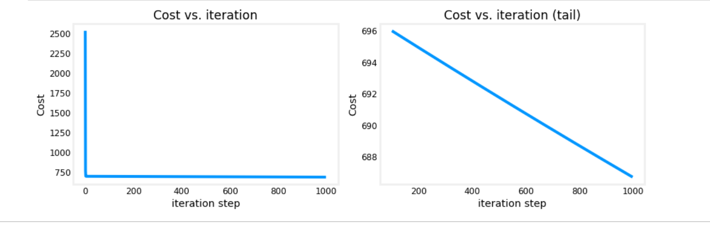

The plots show the cost decreasing rapidly at first and then slowly converging, which is the expected behavior of gradient descent.  

These results are not inspiring! Cost is still declining and our predictions are not very accurate. The next lab will explore how to improve on this.


## Practice Quiz: Multiple linear regression  

Question 1:
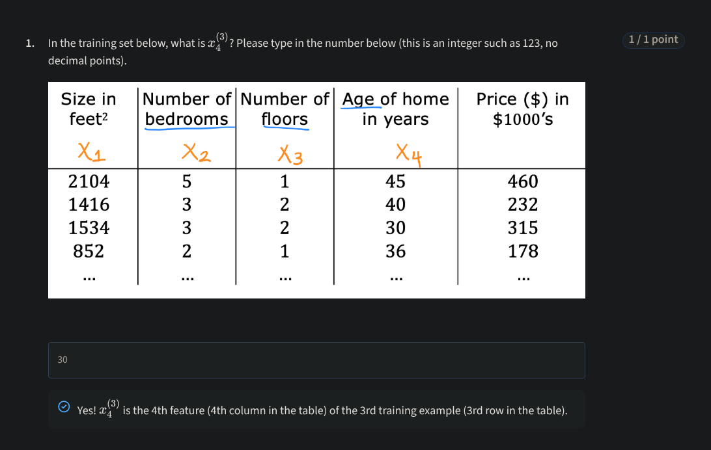
  
Question 2:
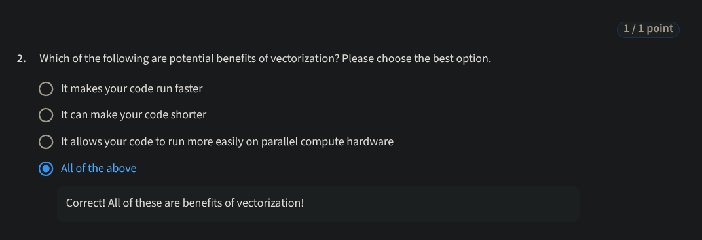
  
Question 3:
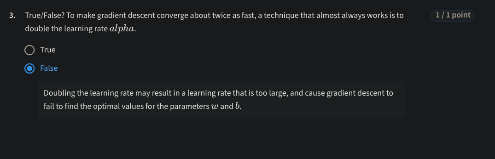