# 📝 Advanced Regression Techniques

This document consolidates notes on advanced techniques for linear regression, including feature scaling, feature engineering, and polynomial regression, along with practical lab exercises.

---

## ⚖️ Scaling Features for Better Performance

When features in a dataset have vastly different ranges, it can slow down the convergence of gradient descent. Feature scaling is a technique to bring all features into a similar range, which helps gradient descent find the optimal solution more quickly.

For example, consider predicting house prices with two features:
*   **Size (sq. ft.):** Ranges from 300 to 5000.
*   **Number of Bedrooms:** Ranges from 1 to 5.

The parameter `w₁` associated with `size` will be very small, while the parameter `w₂` associated with `bedrooms` will be much larger.

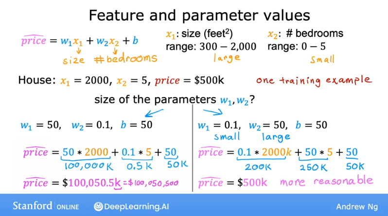

### The Impact on the Cost Function

This disparity in feature scales leads to a cost function `J(w,b)` with elongated, skinny contours.

*   A small change in `w₁` (for `size`) causes a large change in the cost.
*   A large change in `w₂` (for `bedrooms`) is needed to affect the cost similarly.

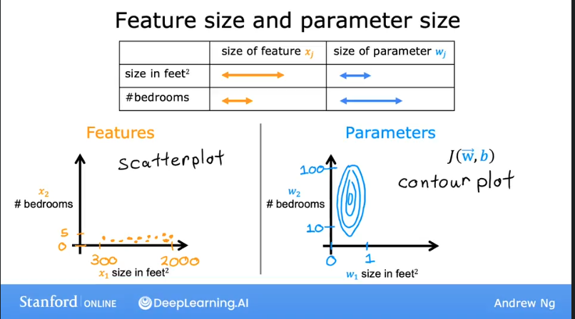

As a result, the contour plot looks like a set of tall, narrow ellipses. Gradient descent can struggle with such a surface, often bouncing back and forth inefficiently before reaching the minimum.

By scaling the features (e.g., transforming both to a range of 0 to 1), the contours of the cost function become more circular. This allows gradient descent to take a more direct path to the global minimum.

### 🎯 Goal of Feature Scaling

The main goal is to transform features so they have comparable ranges. This ensures that each feature contributes more equally to the model's learning process and helps gradient descent converge faster.

### Methods for Feature Scaling

Here are three common methods for feature scaling:

1.  **Dividing by the Maximum**
    *   **Formula:** `x₁ = x₁ / max(x)`
    *   This scales the feature to a range between 0 and 1 (or -1 and 1 if there are negative values). It's simple and effective for features that are strictly positive.
    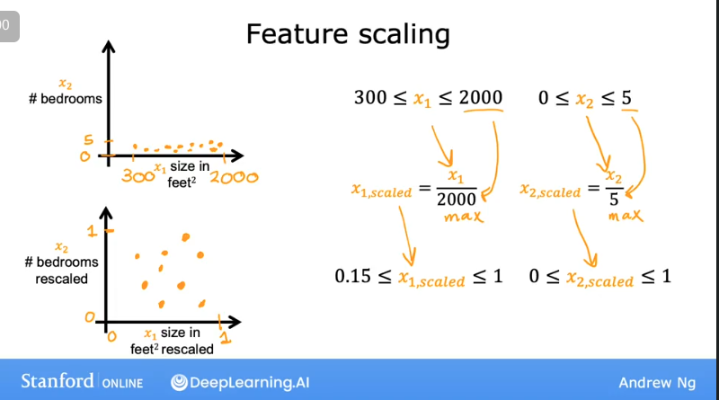

2.  **Mean Normalization**
    *   **Formula:** `x₁ = (x₁ - μ) / (max - min)`
    *   This method centers the data around 0 and scales it by the range. The resulting features will generally be in the range of -1 to 1.
    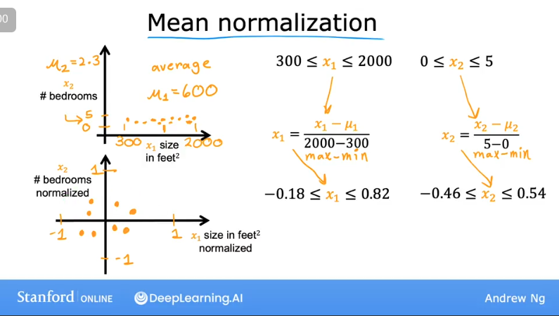

3.  **Z-Score Normalization**
    *   **Formula:** `x₁ = (x₁ - μ₁) / σ₁` (where `μ₁` is the mean and `σ₁` is the standard deviation of feature `x₁`)
    *   This is a very common and effective method. It rescales features to have a mean of 0 and a standard deviation of 1.
    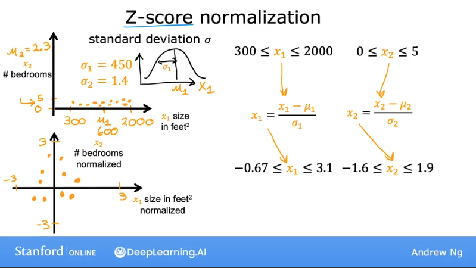

> **💡 Note:** When in doubt, applying feature scaling is generally a good idea and rarely hurts the model's performance.

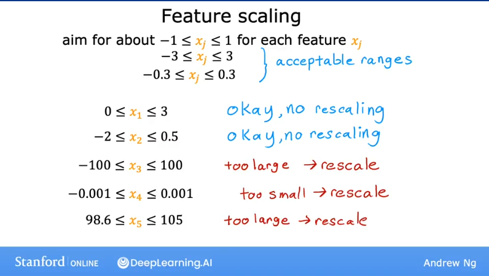

### ❓ Knowledge Check

**Question:** Which of the following is a valid step used during feature scaling?

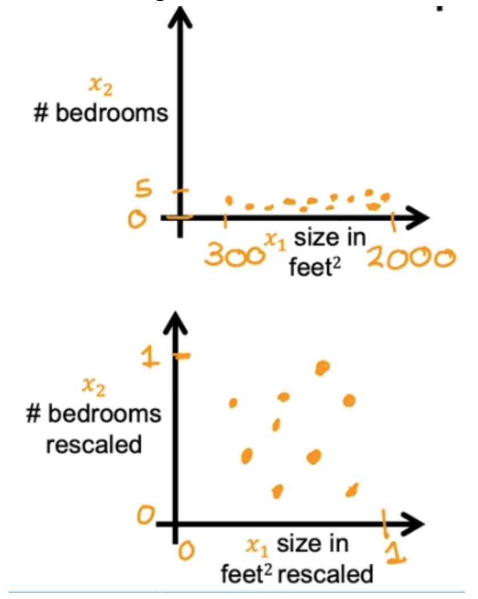

A. Multiply each value by the maximum value for that feature.
B. Divide each value by the maximum value for that feature.

**Answer:**
> **B.** By dividing all values by the maximum, the new range of the rescaled features will have a maximum value of 1.

---

## 📉 Monitoring Gradient Descent

It's crucial to monitor gradient descent to ensure it's converging correctly.

### Checking for Convergence

A **learning curve** is a plot of the cost function `J(w,b)` over the number of iterations.

*   If gradient descent is working correctly, the cost `J(w,b)` should decrease after every iteration.
*   The curve should eventually flatten out, indicating that the algorithm has converged to a minimum.

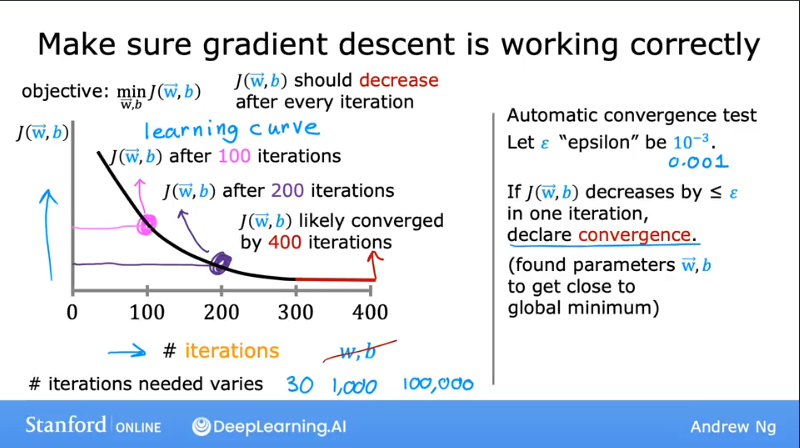

### Choosing the Right Learning Rate (α)

The learning rate `α` is a critical hyperparameter.

*   **If `α` is too large:** The cost may increase or oscillate wildly. The algorithm might "overshoot" the minimum and diverge.
*   **If `α` is too small:** Gradient descent will be very slow to converge.

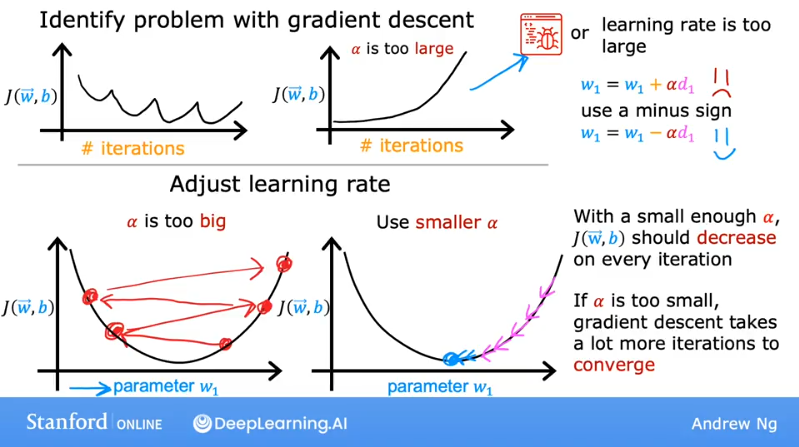

A good approach is to try a range of `α` values (e.g., 0.001, 0.01, 0.1, 1.0) and plot their learning curves to find a value that causes the cost to decrease quickly and consistently.

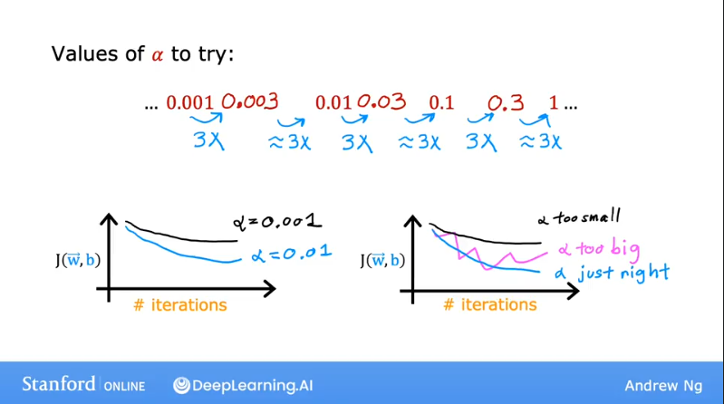

### ❓ Knowledge Check

**Question:** You run gradient descent for 15 iterations with α = 0.3 and compute `J(w)` after each iteration. You find that the value of `J(w)` increases over time. How do you think you should adjust the learning rate α?

A. Try a larger value of α = 1.0
B. Keep running it for additional iterations
C. Try a smaller value of α = 0.1
D. Try running it for only 10 iterations so `J(w)` doesn't increase as much.

**Answer:**
> **C.** Since the cost function is increasing, we know that gradient descent is diverging. This indicates that the learning rate is too high, so we should try a smaller value.

---

## 🧪 Lab: Feature Scaling and Learning Rate in Practice

### Goals
*   Run Gradient Descent on a dataset with multiple features.
*   Explore the impact of the learning rate `α` on convergence.
*   Improve performance by applying Z-score normalization.

### Problem Statement

You will use a housing dataset with four features to predict the price of a house.

| Feature         | Description                       |
|-----------------|-----------------------------------|
| `size(sqft)`    | Size of the house in square feet. |
| `bedrooms`      | Number of bedrooms.               |
| `floors`        | Number of floors.                 |
| `age`           | Age of the house in years.        |

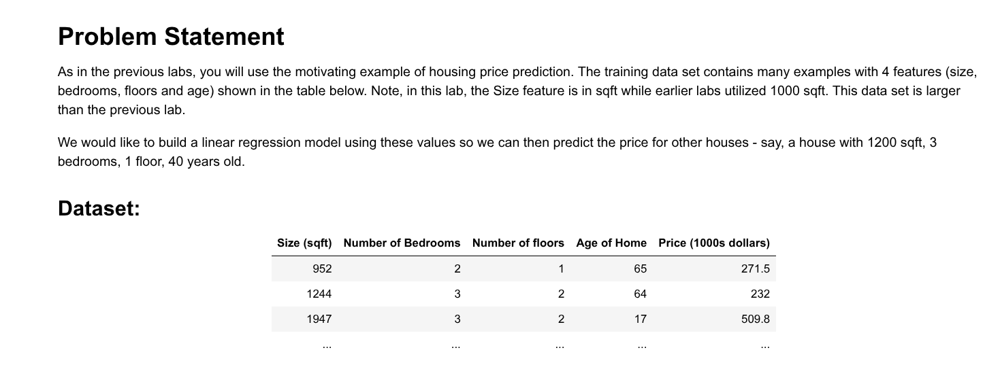
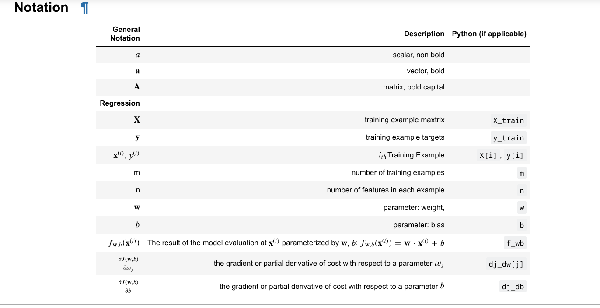

### Setup

```python
import numpy as np
import matplotlib.pyplot as plt
from lab_utils_multi import  load_house_data, run_gradient_descent
from lab_utils_multi import  norm_plot, plt_equal_scale, plot_cost_i_w
from lab_utils_common import dlc
np.set_printoptions(precision=2)
plt.style.use('./deeplearning.mplstyle')
```

### Load and Visualize the Data

```python
# load the dataset
X_train, y_train = load_house_data()
X_features = ['size(sqft)','bedrooms','floors','age']

# Plot each feature vs. the target, price
fig,ax=plt.subplots(1, 4, figsize=(12, 3), sharey=True)
for i in range(len(ax)):
    ax[i].scatter(X_train[:,i],y_train)
    ax[i].set_xlabel(X_features[i])
ax[0].set_ylabel("Price (1000's)")
plt.show()
```

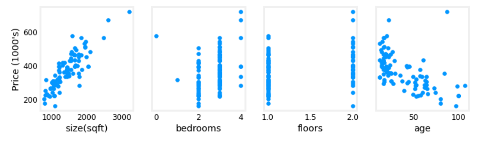

The plots show that `size` and `age` have a stronger correlation with `price` than `bedrooms` or `floors`.

### Gradient Descent for Multiple Variables

The update rules for gradient descent remain the same, but are now applied to each parameter `wⱼ` and `b`.

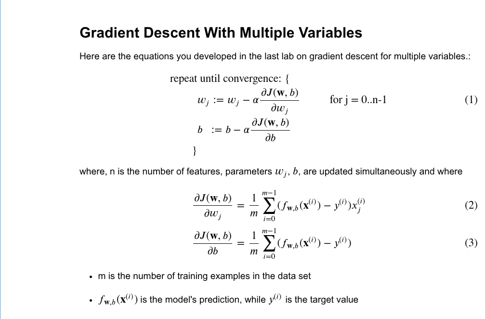

### The Impact of the Learning Rate (α)

Let's run gradient descent with the raw (unscaled) data and observe the effect of different learning rates.

**1. `α = 9.9e-7` (Too Large)**

```python
#set alpha to 9.9e-7
_, _, hist = run_gradient_descent(X_train, y_train, 10, alpha = 9.9e-7)
```
The cost function increases with each iteration, a clear sign that the learning rate is too high and the algorithm is diverging.

<details>
<summary>Click to see full output</summary>

```
Iteration Cost          w0       w1       w2       w3       b       djdw0    djdw1    djdw2    djdw3    djdb
---------------------|--------|--------|--------|--------|--------|--------|--------|--------|--------|--------|
        0 9.55884e+04  5.5e-01  1.0e-03  5.1e-04  1.2e-02  3.6e-04 -5.5e+05 -1.0e+03 -5.2e+02 -1.2e+04 -3.6e+02
        1 1.28213e+05 -8.8e-02 -1.7e-04 -1.0e-04 -3.4e-03 -4.8e-05  6.4e+05  1.2e+03  6.2e+02  1.6e+04  4.1e+02
        2 1.72159e+05  6.5e-01  1.2e-03  5.9e-04  1.3e-02  4.3e-04 -7.4e+05 -1.4e+03 -7.0e+02 -1.7e+04 -4.9e+02
        3 2.31358e+05 -2.1e-01 -4.0e-04 -2.3e-04 -7.5e-03 -1.2e-04  8.6e+05  1.6e+03  8.3e+02  2.1e+04  5.6e+02
        4 3.11100e+05  7.9e-01  1.4e-03  7.1e-04  1.5e-02  5.3e-04 -1.0e+06 -1.8e+03 -9.5e+02 -2.3e+04 -6.6e+02
        5 4.18517e+05 -3.7e-01 -7.1e-04 -4.0e-04 -1.3e-02 -2.1e-04  1.2e+06  2.1e+03  1.1e+03  2.8e+04  7.5e+02
        6 5.63212e+05  9.7e-01  1.7e-03  8.7e-04  1.8e-02  6.6e-04 -1.3e+06 -2.5e+03 -1.3e+03 -3.1e+04 -8.8e+02
        7 7.58122e+05 -5.8e-01 -1.1e-03 -6.2e-04 -1.9e-02 -3.4e-04  1.6e+06  2.9e+03  1.5e+03  3.8e+04  1.0e+03
        8 1.02068e+06  1.2e+00  2.2e-03  1.1e-03  2.3e-02  8.3e-04 -1.8e+06 -3.3e+03 -1.7e+03 -4.2e+04 -1.2e+03
        9 1.37435e+06 -8.7e-01 -1.7e-03 -9.1e-04 -2.7e-02 -5.2e-04  2.1e+06  3.9e+03  2.0e+03  5.1e+04  1.4e+03
w,b found by gradient descent: w: [-0.87 -0.   -0.   -0.03], b: -0.00
```
</details>

```python
plot_cost_i_w(X_train, y_train, hist)
```
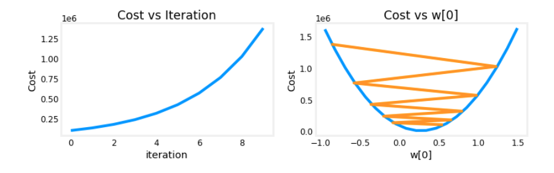

**2. `α = 9e-7` (Moderate)**

```python
#set alpha to 9e-7
_,_,hist = run_gradient_descent(X_train, y_train, 10, alpha = 9e-7)
```
The cost is now decreasing, but the parameter `w₀` is oscillating around the optimal value, indicating the learning rate is still a bit high, causing it to "jump over" the minimum. It will eventually converge, but slowly.

<details>
<summary>Click to see full output</summary>

```
Iteration Cost          w0       w1       w2       w3       b       djdw0    djdw1    djdw2    djdw3    djdb
---------------------|--------|--------|--------|--------|--------|--------|--------|--------|--------|--------|
        0 6.64616e+04  5.0e-01  9.1e-04  4.7e-04  1.1e-02  3.3e-04 -5.5e+05 -1.0e+03 -5.2e+02 -1.2e+04 -3.6e+02
        1 6.18990e+04  1.8e-02  2.1e-05  2.0e-06 -7.9e-04  1.9e-05  5.3e+05  9.8e+02  5.2e+02  1.3e+04  3.4e+02
        2 5.76572e+04  4.8e-01  8.6e-04  4.4e-04  9.5e-03  3.2e-04 -5.1e+05 -9.3e+02 -4.8e+02 -1.1e+04 -3.4e+02
        3 5.37137e+04  3.4e-02  3.9e-05  2.8e-06 -1.6e-03  3.8e-05  4.9e+05  9.1e+02  4.8e+02  1.2e+04  3.2e+02
        4 5.00474e+04  4.6e-01  8.2e-04  4.1e-04  8.0e-03  3.2e-04 -4.8e+05 -8.7e+02 -4.5e+02 -1.1e+04 -3.1e+02
        5 4.66388e+04  5.0e-02  5.6e-05  2.5e-06 -2.4e-03  5.6e-05  4.6e+05  8.5e+02  4.5e+02  1.2e+04  2.9e+02
        6 4.34700e+04  4.5e-01  7.8e-04  3.8e-04  6.4e-03  3.2e-04 -4.4e+05 -8.1e+02 -4.2e+02 -9.8e+03 -2.9e+02
        7 4.05239e+04  6.4e-02  7.0e-05  1.2e-06 -3.3e-03  7.3e-05  4.3e+05  7.9e+02  4.2e+02  1.1e+04  2.7e+02
        8 3.77849e+04  4.4e-01  7.5e-04  3.5e-04  4.9e-03  3.2e-04 -4.1e+05 -7.5e+02 -3.9e+02 -9.1e+03 -2.7e+02
        9 3.52385e+04  7.7e-02  8.3e-05 -1.1e-06 -4.2e-03  8.9e-05  4.0e+05  7.4e+02  3.9e+02  1.0e+04  2.5e+02
w,b found by gradient descent: w: [ 7.74e-02  8.27e-05 -1.06e-06 -4.20e-03], b: 0.00
```
</details>

```python
plot_cost_i_w(X_train, y_train, hist)
```
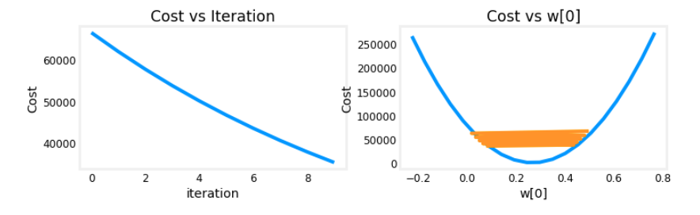

**3. `α = 1e-7` (Too Small)**
```python
#set alpha to 1e-7
_,_,hist = run_gradient_descent(X_train, y_train, 10, alpha = 1e-7)
```
The cost decreases steadily, but very slowly. This would require many more iterations to converge.

<details>
<summary>Click to see full output</summary>

```
Iteration Cost          w0       w1       w2       w3       b       djdw0    djdw1    djdw2    djdw3    djdb
---------------------|--------|--------|--------|--------|--------|--------|--------|--------|--------|--------|
        0 4.42313e+04  5.5e-02  1.0e-04  5.2e-05  1.2e-03  3.6e-05 -5.5e+05 -1.0e+03 -5.2e+02 -1.2e+04 -3.6e+02
        1 2.76461e+04  9.8e-02  1.8e-04  9.2e-05  2.2e-03  6.5e-05 -4.3e+05 -7.9e+02 -4.0e+02 -9.5e+03 -2.8e+02
        2 1.75102e+04  1.3e-01  2.4e-04  1.2e-04  2.9e-03  8.7e-05 -3.4e+05 -6.1e+02 -3.1e+02 -7.3e+03 -2.2e+02
        3 1.13157e+04  1.6e-01  2.9e-04  1.5e-04  3.5e-03  1.0e-04 -2.6e+05 -4.8e+02 -2.4e+02 -5.6e+03 -1.8e+02
        4 7.53002e+03  1.8e-01  3.3e-04  1.7e-04  3.9e-03  1.2e-04 -2.1e+05 -3.7e+02 -1.9e+02 -4.2e+03 -1.4e+02
        5 5.21639e+03  2.0e-01  3.5e-04  1.8e-04  4.2e-03  1.3e-04 -1.6e+05 -2.9e+02 -1.5e+02 -3.1e+03 -1.1e+02
        6 3.80242e+03  2.1e-01  3.8e-04  1.9e-04  4.5e-03  1.4e-04 -1.3e+05 -2.2e+02 -1.1e+02 -2.3e+03 -8.6e+01
        7 2.93826e+03  2.2e-01  3.9e-04  2.0e-04  4.6e-03  1.4e-04 -9.8e+04 -1.7e+02 -8.6e+01 -1.7e+03 -6.8e+01
        8 2.41013e+03  2.3e-01  4.1e-04  2.1e-04  4.7e-03  1.5e-04 -7.7e+04 -1.3e+02 -6.5e+01 -1.2e+03 -5.4e+01
        9 2.08734e+03  2.3e-01  4.2e-04  2.1e-04  4.8e-03  1.5e-04 -6.0e+04 -1.0e+02 -4.9e+01 -7.5e+02 -4.3e+01
w,b found by gradient descent: w: [2.31e-01 4.18e-04 2.12e-04 4.81e-03], b: 0.00
```
</details>

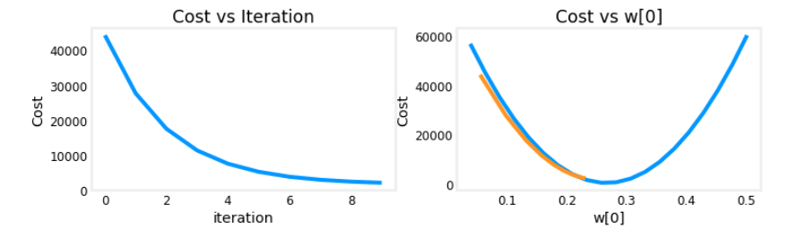

This process highlights the difficulty of finding a good learning rate when features have very different scales.

### Feature Scaling in Action

Let's apply Z-score normalization to solve this problem.

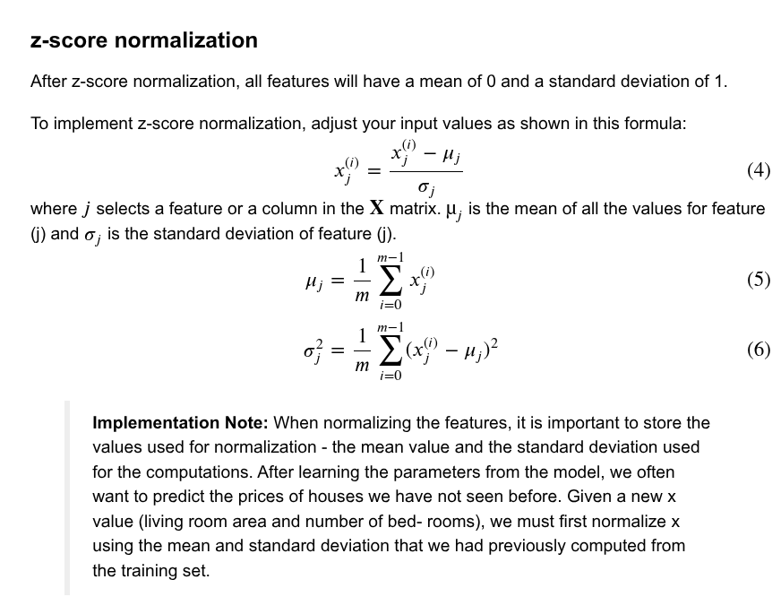

#### Implementation

```python
def zscore_normalize_features(X):
    """
    computes  X, zcore normalized by column
    
    Args:
      X (ndarray (m,n))     : input data, m examples, n features
      
    Returns:
      X_norm (ndarray (m,n)): input normalized by column
      mu (ndarray (n,))     : mean of each feature
      sigma (ndarray (n,))  : standard deviation of each feature
    """
    # find the mean of each column/feature
    mu     = np.mean(X, axis=0)
    # find the standard deviation of each column/feature
    sigma  = np.std(X, axis=0)
    # element-wise, subtract mu for that column from each example, divide by std for that column
    X_norm = (X - mu) / sigma      

    return (X_norm, mu, sigma)
```

#### Visualizing the Transformation

The normalization process centers each feature around zero and gives it a standard deviation of one.

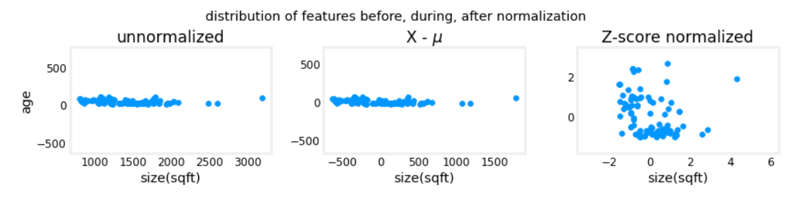

*   **Left (Unnormalized):** The scale of `size(sqft)` is vastly different from `age`.
*   **Middle (Mean Subtracted):** The features are centered around zero.
*   **Right (Z-score Normalized):** Both features are now centered at zero and have a similar scale.

#### Applying Normalization to the Data

```python
# normalize the original features
X_norm, X_mu, X_sigma = zscore_normalize_features(X_train)
print(f"X_mu = {X_mu}, \nX_sigma = {X_sigma}")
print(f"Peak to Peak range by column in Raw        X:{np.ptp(X_train,axis=0)}")   
print(f"Peak to Peak range by column in Normalized X:{np.ptp(X_norm,axis=0)}")
```
**Output:**
```
X_mu = [1.42e+03 2.72e+00 1.38e+00 3.84e+01], 
X_sigma = [411.62   0.65   0.49  25.78]
Peak to Peak range by column in Raw        X:[2.41e+03 4.00e+00 1.00e+00 9.50e+01]
Peak to Peak range by column in Normalized X:[5.85 6.14 2.06 3.69]
```
The peak-to-peak range is now much more consistent across features.

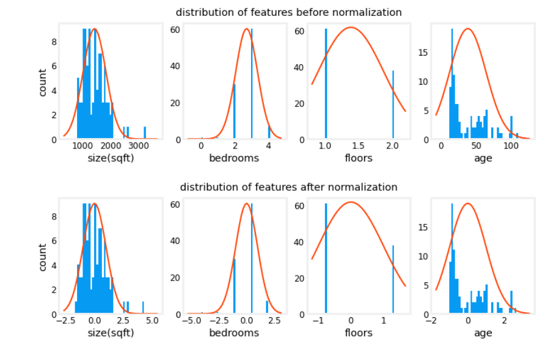

#### Rerunning Gradient Descent with Normalized Data

With scaled features, we can use a much larger learning rate, `α = 1.0e-1`, which drastically speeds up convergence.

```python
w_norm, b_norm, hist = run_gradient_descent(X_norm, y_train, 1000, 1.0e-1)
```

<details>
<summary>Click to see full output</summary>

```
Iteration Cost          w0       w1       w2       w3       b       djdw0    djdw1    djdw2    djdw3    djdb
---------------------|--------|--------|--------|--------|--------|--------|--------|--------|--------|--------|
        0 5.76170e+04  8.9e+00  3.0e+00  3.3e+00 -6.0e+00  3.6e+01 -8.9e+01 -3.0e+01 -3.3e+01  6.0e+01 -3.6e+02
      100 2.21086e+02  1.1e+02 -2.0e+01 -3.1e+01 -3.8e+01  3.6e+02 -9.2e-01  4.5e-01  5.3e-01 -1.7e-01 -9.6e-03
      200 2.19209e+02  1.1e+02 -2.1e+01 -3.3e+01 -3.8e+01  3.6e+02 -3.0e-02  1.5e-02  1.7e-02 -6.0e-03 -2.6e-07
      300 2.19207e+02  1.1e+02 -2.1e+01 -3.3e+01 -3.8e+01  3.6e+02 -1.0e-03  5.1e-04  5.7e-04 -2.0e-04 -6.9e-12
      400 2.19207e+02  1.1e+02 -2.1e+01 -3.3e+01 -3.8e+01  3.6e+02 -3.4e-05  1.7e-05  1.9e-05 -6.6e-06 -2.7e-13
      500 2.19207e+02  1.1e+02 -2.1e+01 -3.3e+01 -3.8e+01  3.6e+02 -1.1e-06  5.6e-07  6.2e-07 -2.2e-07 -2.6e-13
      600 2.19207e+02  1.1e+02 -2.1e+01 -3.3e+01 -3.8e+01  3.6e+02 -3.7e-08  1.9e-08  2.1e-08 -7.3e-09 -2.6e-13
      700 2.19207e+02  1.1e+02 -2.1e+01 -3.3e+01 -3.8e+01  3.6e+02 -1.2e-09  6.2e-10  6.9e-10 -2.4e-10 -2.6e-13
      800 2.19207e+02  1.1e+02 -2.1e+01 -3.3e+01 -3.8e+01  3.6e+02 -4.1e-11  2.1e-11  2.3e-11 -8.1e-12 -2.7e-13
      900 2.19207e+02  1.1e+02 -2.1e+01 -3.3e+01 -3.8e+01  3.6e+02 -1.4e-12  7.0e-13  7.6e-13 -2.7e-13 -2.6e-13
w,b found by gradient descent: w: [110.56 -21.27 -32.71 -37.97], b: 363.16
```
</details>

The model converges very quickly to a low cost. The scaled features allow for much faster and more stable training.

#### Predictions vs. Target Values
```python
#predict target using normalized features
m = X_norm.shape[0]
yp = np.zeros(m)
for i in range(m):
    yp[i] = np.dot(X_norm[i], w_norm) + b_norm

# plot predictions and targets versus original features    
fig,ax=plt.subplots(1,4,figsize=(12, 3),sharey=True)
for i in range(len(ax)):
    ax[i].scatter(X_train[:,i],y_train, label = 'target')
    ax[i].set_xlabel(X_features[i])
    ax[i].scatter(X_train[:,i],yp,color=dlc["dlorange"], label = 'predict')
ax[0].set_ylabel("Price"); ax[0].legend();
fig.suptitle("target versus prediction using z-score normalized model")
plt.show()
```

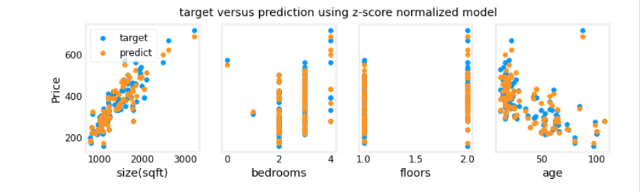

The model provides good predictions across all features.

#### Predicting on New Data

To predict the price of a new house, you must normalize its features using the **same `mu` and `sigma`** calculated from the training set.

```python
# Predict the price of a house with 1200 sqft, 3 bedrooms, 1 floor, 40 years old.
x_house = np.array([1200, 3, 1, 40])
x_house_norm = (x_house - X_mu) / X_sigma
print(x_house_norm)
x_house_predict = np.dot(x_house_norm, w_norm) + b_norm
print(f" predicted price of a house with 1200 sqft, 3 bedrooms, 1 floor, 40 years old = ${x_house_predict*1000:0.0f}")
```
**Output:**
```
[-0.53  0.43 -0.79  0.06]
 predicted price of a house with 1200 sqft, 3 bedrooms, 1 floor, 40 years old = $318709
```

#### Cost Contours Comparison

These plots visually confirm why feature scaling works. The contours for the unscaled data are elongated, while the normalized data yields circular contours, making the path to the minimum much more direct.

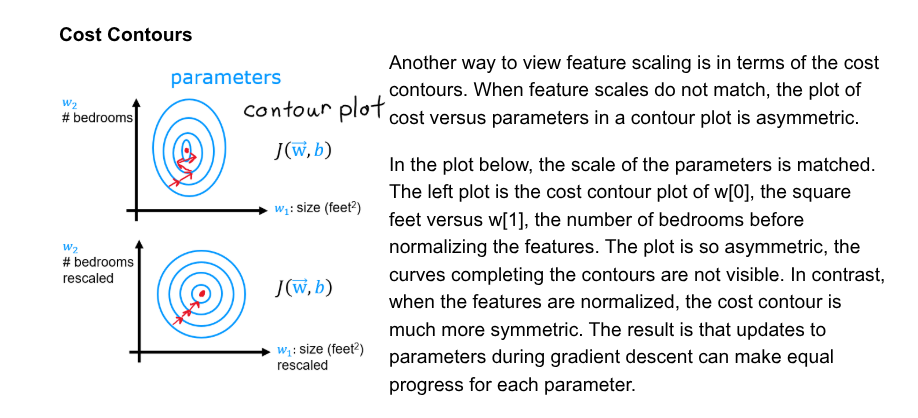
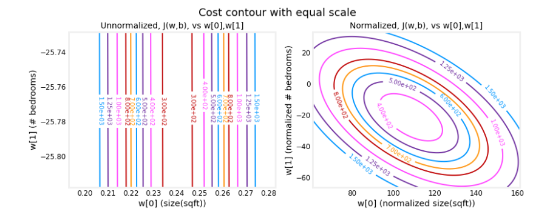

---

## 🛠️ Feature Engineering & Polynomial Regression

Linear regression can be extended to model non-linear relationships through **feature engineering**, which is the process of creating new features by transforming or combining existing ones.

### Feature Engineering

The choice of features significantly impacts a model's performance. By using domain knowledge and intuition, we can create features that better capture the underlying patterns in the data.

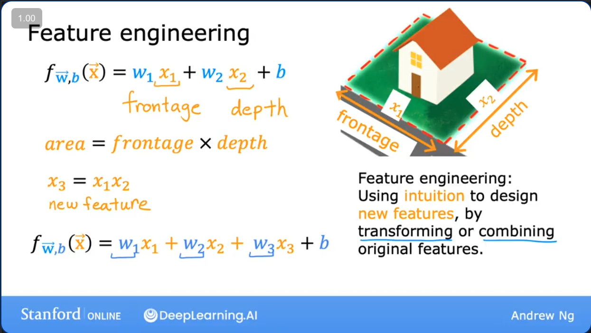

#### ❓ Knowledge Check

**Question:** If you have measurements for the dimensions of a swimming pool (length, width, height), which of the following two would be a more useful engineered feature?

A. `length × width × height`
B. `length + width + height`

**Answer:**
> **A.** The volume (`length × width × height`) of the swimming pool is likely a more useful feature for many prediction tasks (e.g., predicting the cost to fill it) than the sum of its dimensions.

### Polynomial Regression

What if your data doesn't follow a straight line? You can still use linear regression by engineering new **polynomial features**.

For example, if your data seems to follow a quadratic curve:

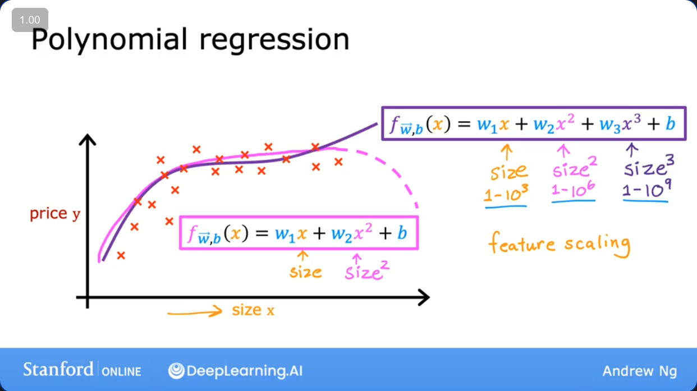

Instead of the model `f(x) = w₁x₁ + b`, you can create a new feature `x₁²` and fit the model:
`f(x) = w₁x₁ + w₂(x₁²) + b`

Even though the function is a curve with respect to `x`, it is a **linear function** with respect to the features `x₁` and `x₁²`. This allows us to use the same linear regression algorithm.

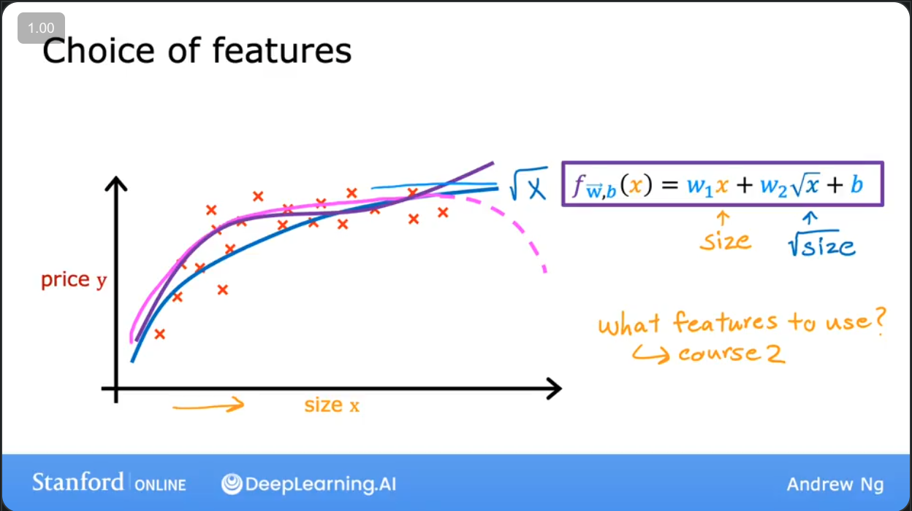

---

## 🧪 Lab: Implementing Polynomial Regression

### Goals
*   Explore how to use feature engineering to fit non-linear data.
*   Understand how linear regression can model complex functions through polynomial features.

### Setup
```python
import numpy as np
import matplotlib.pyplot as plt
from lab_utils_multi import zscore_normalize_features, run_gradient_descent_feng
np.set_printoptions(precision=2)  # reduced display precision on numpy arrays
```
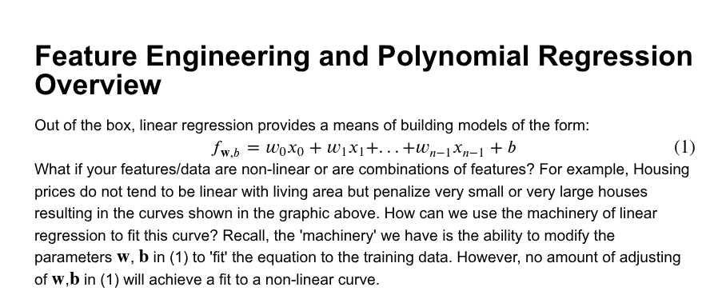
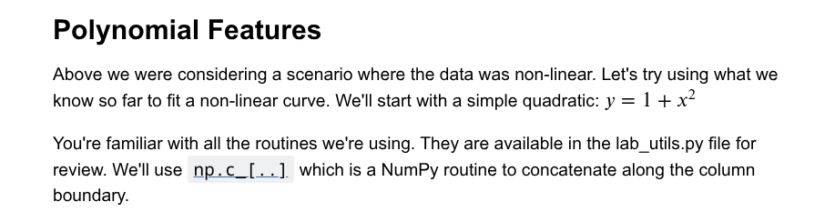

### Linear Model on Non-linear Data

Let's try to fit a linear model to quadratic data `y = 1 + x²`.

```python
# create target data
x = np.arange(0, 20, 1)
y = 1 + x**2
X = x.reshape(-1, 1)

model_w,model_b = run_gradient_descent_feng(X,y,iterations=1000, alpha = 1e-2)

plt.scatter(x, y, marker='x', c='r', label="Actual Value"); plt.title("no feature engineering")
plt.plot(x,X@model_w + model_b, label="Predicted Value");  plt.xlabel("X"); plt.ylabel("y"); plt.legend(); plt.show()
```
**Output:**
```
w,b found by gradient descent: w: [18.7], b: -52.0834
```
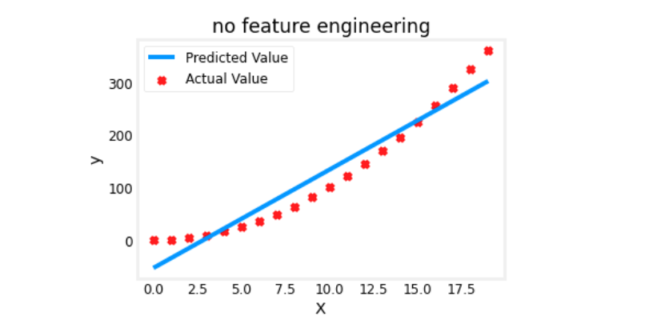

As expected, a straight line is a poor fit for this data.

### Adding a Polynomial Feature (x²)

Now, let's engineer a new feature, `x²`, and train the model again.

```python
# create target data
x = np.arange(0, 20, 1)
y = 1 + x**2

# Engineer features
X = x**2      #<-- added engineered feature
X = X.reshape(-1, 1)  #X should be a 2-D Matrix

model_w,model_b = run_gradient_descent_feng(X, y, iterations=10000, alpha = 1e-5)

plt.scatter(x, y, marker='x', c='r', label="Actual Value"); plt.title("Added x**2 feature")
plt.plot(x, np.dot(X,model_w) + model_b, label="Predicted Value"); plt.xlabel("x"); plt.ylabel("y"); plt.legend(); plt.show()
```
**Output:**
```
w,b found by gradient descent: w: [1.], b: 0.0490
```
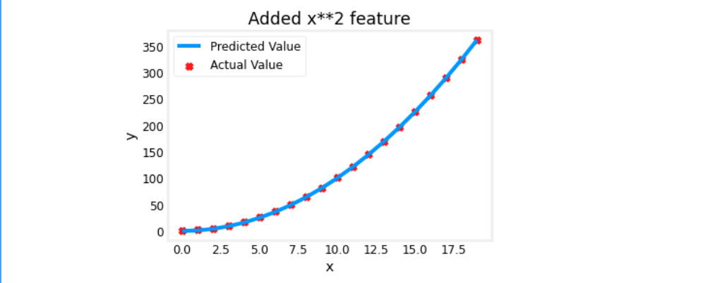

The fit is now nearly perfect! The learned parameters `w=[1.]` and `b=0.0490` are very close to the true model `y = 1 * x² + 1`.

### Selecting Features

What if we aren't sure which polynomial terms are needed? We can add several and let gradient descent figure it out. Let's try fitting `y = x²` with features `x`, `x²`, and `x³`.

```python
# create target data
x = np.arange(0, 20, 1)
y = x**2

# engineer features
X = np.c_[x, x**2, x**3]

model_w,model_b = run_gradient_descent_feng(X, y, iterations=10000, alpha=1e-7)

plt.scatter(x, y, marker='x', c='r', label="Actual Value"); plt.title("x, x**2, x**3 features")
plt.plot(x, X@model_w + model_b, label="Predicted Value"); plt.xlabel("x"); plt.ylabel("y"); plt.legend(); plt.show()
```
**Output:**
```
w,b found by gradient descent: w: [0.08 0.54 0.03], b: 0.0106
```
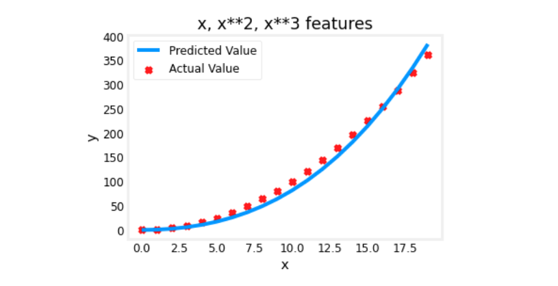

The learned model is `y ≈ 0.08x + 0.54x² + 0.03x³ + 0.01`. Gradient descent has assigned the largest weight (`w₁=0.54`) to the `x²` feature, correctly identifying it as the most important one. The weights for `x` and `x³` are much smaller.

### An Alternate View

The best features for linear regression are those that have a linear relationship with the target `y`. Plotting our engineered features against `y` confirms this.

```python
# create target data
x = np.arange(0, 20, 1)
y = x**2

# engineer features
X = np.c_[x, x**2, x**3]
X_features = ['x','x^2','x^3']

fig,ax=plt.subplots(1, 3, figsize=(12, 3), sharey=True)
for i in range(len(ax)):
    ax[i].scatter(X[:,i],y)
    ax[i].set_xlabel(X_features[i])
ax[0].set_ylabel("y")
plt.show()
```
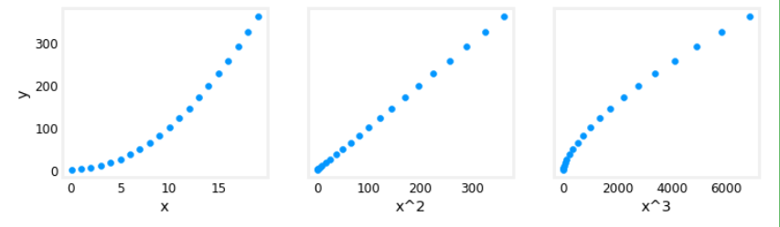

Clearly, `x²` has a linear relationship with `y`, making it the perfect feature for a linear regression model.

### Scaling Features

When creating polynomial features like `x`, `x²`, and `x³`, their scales will be vastly different. Feature scaling is essential here to speed up gradient descent.

```python
# create target data
x = np.arange(0,20,1)
y = x**2

X = np.c_[x, x**2, x**3]
print(f"Peak to Peak range by column in Raw        X:{np.ptp(X,axis=0)}")

# add z-score normalization
X = zscore_normalize_features(X)     
print(f"Peak to Peak range by column in Normalized X:{np.ptp(X,axis=0)}")
```
**Output:**
```
Peak to Peak range by column in Raw        X:[  19  361 6859]
Peak to Peak range by column in Normalized X:[3.3  3.18 3.28]
```
Now, with scaled features, we can use a much larger learning rate and converge faster.

```python
model_w, model_b = run_gradient_descent_feng(X, y, iterations=100000, alpha=1e-1)
# ... plotting code ...
```
**Output:**
```
w,b found by gradient descent: w: [5.27e-05 1.13e+02 8.43e-05], b: 123.5000
```
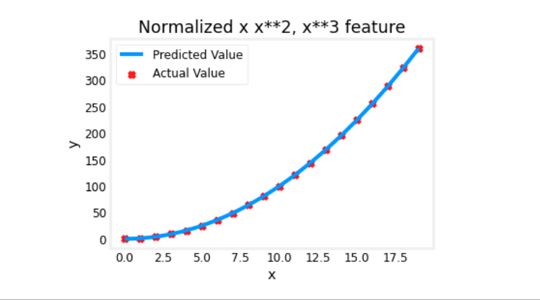

After normalization, gradient descent gives a much larger weight to the `x²` term and almost zero weight to the others, resulting in a very accurate model.

### Modeling Complex Functions

With enough polynomial features, we can model even highly complex functions, like a cosine wave.

```python
x = np.arange(0,20,1)
y = np.cos(x/2)

# Engineer features up to x^13
X = np.c_[x, x**2, x**3,x**4, x**5, x**6, x**7, x**8, x**9, x**10, x**11, x**12, x**13]
# Normalize them
X = zscore_normalize_features(X) 

model_w,model_b = run_gradient_descent_feng(X, y, iterations=1000000, alpha = 1e-1)
# ... plotting code ...
```
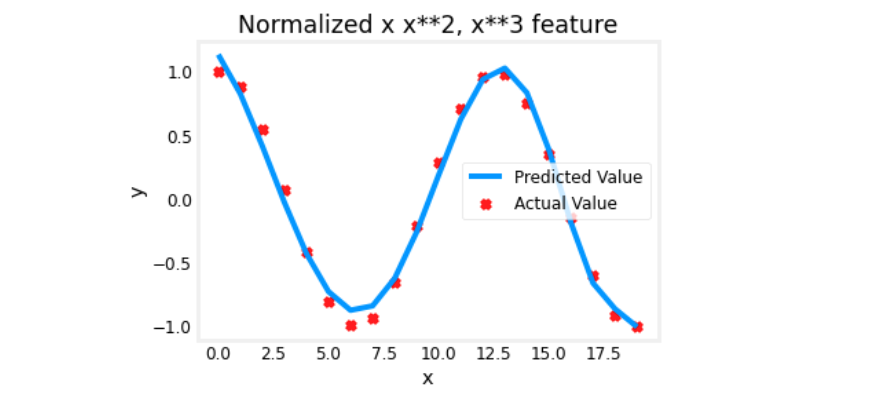

---

## 🤖 Lab: Linear Regression with Scikit-Learn

Instead of implementing algorithms from scratch, we can use powerful, open-source libraries like **scikit-learn**.

### Goals
*   Utilize scikit-learn to implement linear regression using Gradient Descent.

### Setup
```python
import numpy as np
import matplotlib.pyplot as plt
from sklearn.linear_model import SGDRegressor
from sklearn.preprocessing import StandardScaler
from lab_utils_multi import  load_house_data
from lab_utils_common import dlc
np.set_printoptions(precision=2)
plt.style.use('./deeplearning.mplstyle')
```

### 1. Load the Data
```python
X_train, y_train = load_house_data()
X_features = ['size(sqft)','bedrooms','floors','age']
```

### 2. Scale/Normalize the Data
Scikit-learn's `StandardScaler` performs Z-score normalization.
```python
scaler = StandardScaler()
X_norm = scaler.fit_transform(X_train)
print(f"Peak to Peak range by column in Raw        X:{np.ptp(X_train,axis=0)}")   
print(f"Peak to Peak range by column in Normalized X:{np.ptp(X_norm,axis=0)}")
```
**Output:**
```
Peak to Peak range by column in Raw        X:[2.41e+03 4.00e+00 1.00e+00 9.50e+01]
Peak to Peak range by column in Normalized X:[5.85 6.14 2.06 3.69]
```

### 3. Create and Fit the Model
`SGDRegressor` implements linear regression using Stochastic Gradient Descent.
```python
# Create an instance of the model
sgdr = SGDRegressor(max_iter=1000)
# Fit the model to the normalized data
sgdr.fit(X_norm, y_train)
print(sgdr)
print(f"number of iterations completed: {sgdr.n_iter_}, number of weight updates: {sgdr.t_}")
```
**Output:**
```
SGDRegressor()
number of iterations completed: 106, number of weight updates: 10495.0
```

### 4. View Parameters
The learned parameters are stored in `sgdr.coef_` (for `w`) and `sgdr.intercept_` (for `b`).
```python
b_norm = sgdr.intercept_
w_norm = sgdr.coef_
print(f"model parameters:                   w: {w_norm}, b:{b_norm}")
print( "model parameters from previous lab: w: [110.56 -21.27 -32.71 -37.97], b: 363.16")
```
**Output:**
```
model parameters:                   w: [109.79 -20.87 -32.26 -38.1 ], b:[363.16]
model parameters from previous lab: w: [110.56 -21.27 -32.71 -37.97], b: 363.16
```
The results are very close to our manual implementation!

### 5. Make Predictions and Plot Results
```python
# make a prediction using sgdr.predict()
y_pred_sgd = sgdr.predict(X_norm)

# make a prediction using w,b. 
y_pred = np.dot(X_norm, w_norm) + b_norm  
print(f"prediction using np.dot() and sgdr.predict match: {(y_pred == y_pred_sgd).all()}")

print(f"Prediction on training set:\n{y_pred[:4]}" )
print(f"Target values \n{y_train[:4]}")
```
**Output:**
```
prediction using np.dot() and sgdr.predict match: True
Prediction on training set:
[295.19 485.84 389.68 492.  ]
Target values 
[300.  509.8 394.  540. ]
```

```python
# plot predictions and targets vs original features    
fig,ax=plt.subplots(1,4,figsize=(12,3),sharey=True)
for i in range(len(ax)):
    ax[i].scatter(X_train[:,i],y_train, label = 'target')
    ax[i].set_xlabel(X_features[i])
    ax[i].scatter(X_train[:,i],y_pred,color=dlc["dlorange"], label = 'predict')
ax[0].set_ylabel("Price"); ax[0].legend();
fig.suptitle("target versus prediction using z-score normalized model")
plt.show()
```
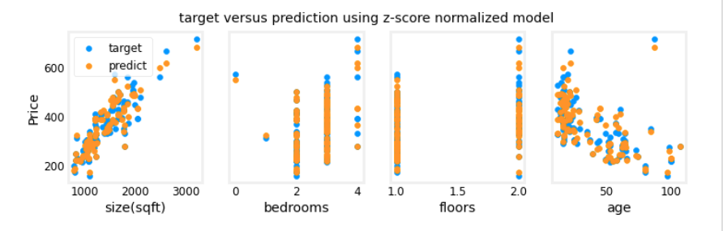

---

## ✍️ Lab: Building Linear Regression from Scratch

This lab walks through the implementation of linear regression for a single variable from the ground up.

### 1 - Packages
```python
import numpy as np
import matplotlib.pyplot as plt
from utils import *
import copy
import math
%matplotlib inline
```

### 2 - Problem Statement
You are the CEO of a restaurant franchise. You have data on profits and populations from cities where your restaurants are located. You want to use this data to predict profits for new candidate cities.

### 3 - Dataset
*   `x_train`: Population of a city (in 10,000s).
*   `y_train`: Profit of a restaurant in that city (in $10,000s).

```python
# load the dataset
x_train, y_train = load_data()
```

#### View and Visualize Data
```python
print ('The shape of x_train is:', x_train.shape)
print ('The shape of y_train is: ', y_train.shape)
print ('Number of training examples (m):', len(x_train))

# Create a scatter plot of the data
plt.scatter(x_train, y_train, marker='x', c='r') 
plt.title("Profits vs. Population per city")
plt.ylabel('Profit in $10,000')
plt.xlabel('Population of City in 10,000s')
plt.show()
```
**Output:**
```
The shape of x_train is: (97,)
The shape of y_train is:  (97,)
Number of training examples (m): 97
```
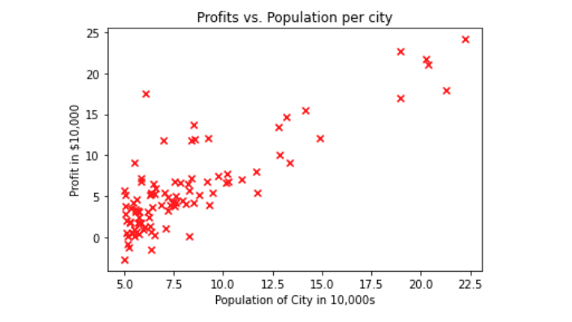

### 4 - Linear Regression Refresher
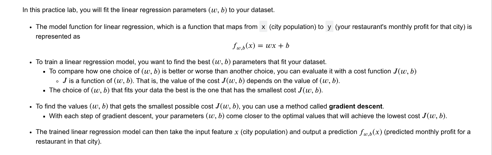

### 5 - Compute Cost Function `J(w,b)`
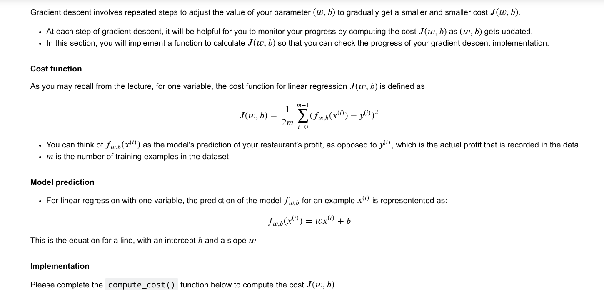

#### Exercise 1: `compute_cost`
Implement the cost function.
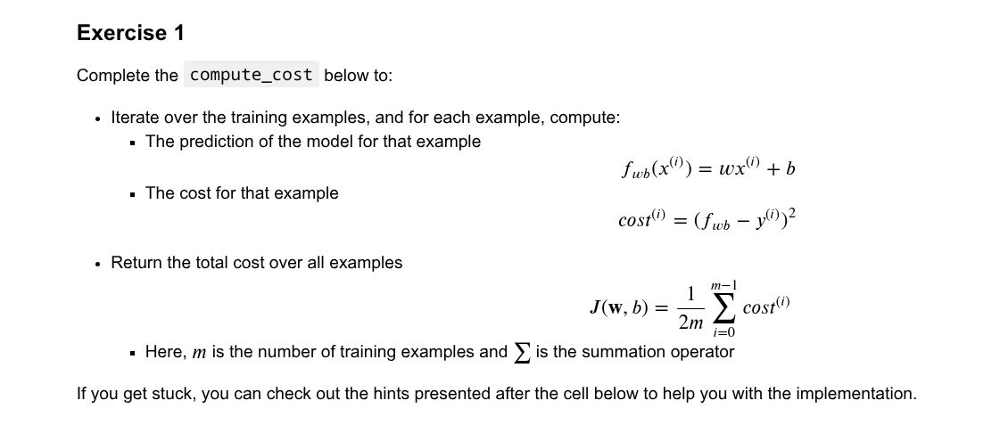

```python
def compute_cost(x, y, w, b): 
    """
    Computes the cost function for linear regression.
    """
    m = x.shape[0] 
    total_cost = 0
    
    for i in range(m):
        f_wb_i = w * x[i] + b
        cost_i = (f_wb_i - y[i]) ** 2
        total_cost += cost_i
    
    total_cost = total_cost / (2 * m)
    return total_cost
```

#### Test `compute_cost`
```python
initial_w = 2
initial_b = 1

cost = compute_cost(x_train, y_train, initial_w, initial_b)
print(f'Cost at initial w: {cost:.3f}')
```
**Output:**
```
Cost at initial w: 75.203
All tests passed!
```

### 6 - Gradient Descent
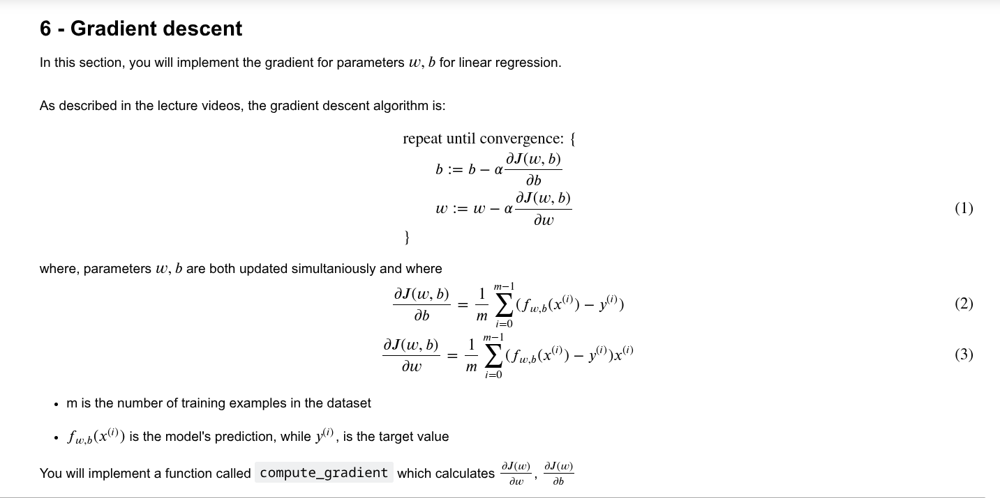

#### Exercise 2: `compute_gradient`
Implement the function to compute the gradients `∂J/∂w` and `∂J/∂b`.
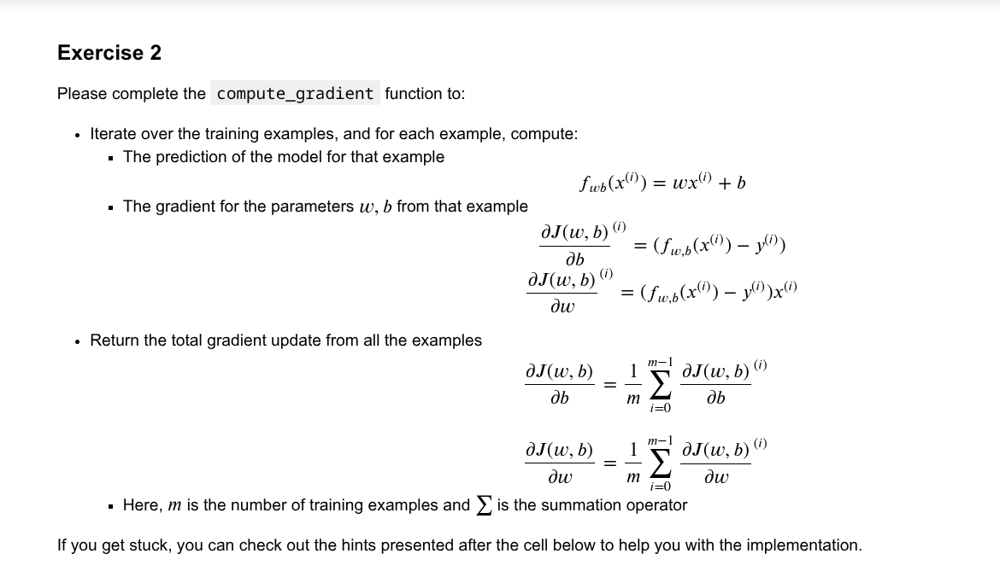

```python
def compute_gradient(x, y, w, b): 
    """
    Computes the gradient for linear regression 
    """
    m = x.shape[0]
    dj_dw = 0
    dj_db = 0
    
    for i in range(m):
        f_wb_i = w * x[i] + b
        err_i = f_wb_i - y[i]
        dj_dw += err_i * x[i]
        dj_db += err_i
    
    dj_dw  = dj_dw / m
    dj_db = dj_db / m
        
    return dj_dw, dj_db
```

<details>
<summary>Click for hints on implementing `compute_gradient`</summary>
    
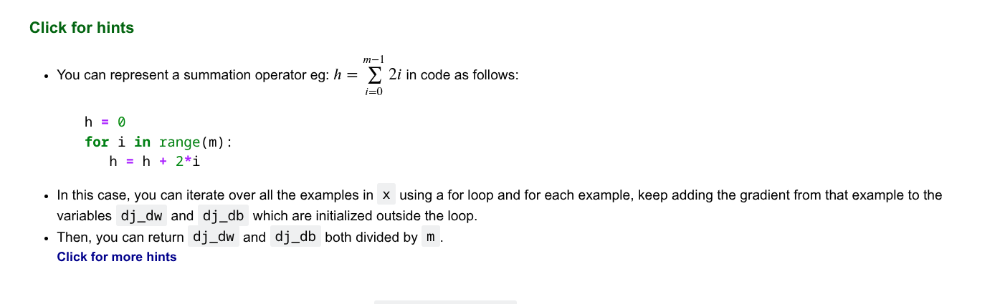

Here's how you can structure the overall implementation for this function
```python
def compute_gradient(x, y, w, b): 
   """
   Computes the gradient for linear regression 
   """
   # Number of training examples
   m = x.shape[0]

   # You need to return the following variables correctly
   dj_dw = 0
   dj_db = 0

   # Loop over examples
   for i in range(m):  
       # Get prediction f_wb for the ith example
       f_wb = w * x[i] + b 

       # Get the error for the ith example
       err = f_wb - y[i]
       
       # Get the gradient for w from the ith example 
       dj_dw_i = err * x[i]

       # Get the gradient for b from the ith example 
       dj_db_i = err

       # Update dj_db : In Python, a += 1  is the same as a = a + 1
       dj_db += dj_db_i

       # Update dj_dw
       dj_dw += dj_dw_i

   # Divide both dj_dw and dj_db by m
   dj_dw = dj_dw / m
   dj_db = dj_db / m

   return dj_dw, dj_db
```
</details>

#### Test `compute_gradient`
```python
# Compute and display gradient with w initialized to zeroes
initial_w = 0
initial_b = 0

tmp_dj_dw, tmp_dj_db = compute_gradient(x_train, y_train, initial_w, initial_b)
print('Gradient at initial w, b (zeros):', tmp_dj_dw, tmp_dj_db)

# Compute and display cost and gradient with non-zero w
test_w = 0.2
test_b = 0.2
tmp_dj_dw, tmp_dj_db = compute_gradient(x_train, y_train, test_w, test_b)
print('Gradient at test w, b:', tmp_dj_dw, tmp_dj_db)
```
**Output:**
```
Gradient at initial w, b (zeros): -65.32884974555672 -5.83913505154639
Gradient at test w, b: -47.41610118114435 -4.007175051546391
All tests passed!
```

### Learning Parameters with Batch Gradient Descent
Now we combine the cost and gradient functions to implement gradient descent.

```python
def gradient_descent(x, y, w_in, b_in, cost_function, gradient_function, alpha, num_iters): 
    """
    Performs batch gradient descent to learn theta. Updates theta by taking 
    num_iters gradient steps with learning rate alpha
    
    Args:
      x :    (ndarray): Shape (m,)
      y :    (ndarray): Shape (m,)
      w_in, b_in : (scalar) Initial values of parameters of the model
      cost_function: function to compute cost
      gradient_function: function to compute the gradient
      alpha : (float) Learning rate
      num_iters : (int) number of iterations to run gradient descent
    Returns
      w : (ndarray): Shape (1,) Updated values of parameters of the model after
          running gradient descent
      b : (scalar)                Updated value of parameter of the model after
          running gradient descent
    """
    
    # number of training examples
    m = len(x)
    
    # An array to store cost J and w's at each iteration — primarily for graphing later
    J_history = []
    w_history = []
    w = copy.deepcopy(w_in)  #avoid modifying global w within function
    b = b_in
    
    for i in range(num_iters):

        # Calculate the gradient and update the parameters
        dj_dw, dj_db = gradient_function(x, y, w, b )  

        # Update Parameters using w, b, alpha and gradient
        w = w - alpha * dj_dw               
        b = b - alpha * dj_db               

        # Save cost J at each iteration
        if i<100000:      # prevent resource exhaustion 
            cost =  cost_function(x, y, w, b)
            J_history.append(cost)

        # Print cost every at intervals 10 times or as many iterations if < 10
        if i% math.ceil(num_iters/10) == 0:
            w_history.append(w)
            print(f"Iteration {i:4}: Cost {float(J_history[-1]):8.2f}   ")
        
    return w, b, J_history, w_history #return w and J,w history for graphing
```


#### Run Gradient Descent
```python
# initialize fitting parameters
initial_w = 0.
initial_b = 0.

# some gradient descent settings
iterations = 1500
alpha = 0.01

w,b,_,_ = gradient_descent(x_train ,y_train, initial_w, initial_b, 
                     compute_cost, compute_gradient, alpha, iterations)
print("w,b found by gradient descent:", w, b)
```
**Output:**
```
Iteration    0: Cost     6.74   
Iteration  150: Cost     5.31   
Iteration  300: Cost     4.96   
Iteration  450: Cost     4.76   
Iteration  600: Cost     4.64   
Iteration  750: Cost     4.57   
Iteration  900: Cost     4.53   
Iteration 1050: Cost     4.51   
Iteration 1200: Cost     4.50   
Iteration 1350: Cost     4.49   
w,b found by gradient descent: 1.166362350335582 -3.63029143940436
```

#### Plot the Linear Fit
```python
m = x_train.shape[0]
predicted = np.zeros(m)

for i in range(m):
    predicted[i] = w * x_train[i] + b
    
# Plot the linear fit
plt.plot(x_train, predicted, c = "b")
# Create a scatter plot of the data. 
plt.scatter(x_train, y_train, marker='x', c='r') 
plt.title("Profits vs. Population per city")
plt.ylabel('Profit in $10,000')
plt.xlabel('Population of City in 10,000s')
```
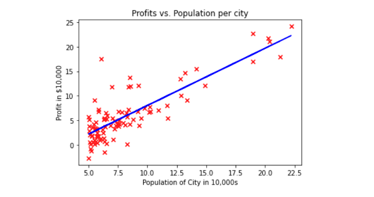

#### Make Predictions
```python
predict1 = 3.5 * w + b
print('For population = 35,000, we predict a profit of $%.2f' % (predict1*10000))

predict2 = 7.0 * w + b
print('For population = 70,000, we predict a profit of $%.2f' % (predict2*10000))
```
**Output:**
```
For population = 35,000, we predict a profit of $4519.77
For population = 70,000, we predict a profit of $45342.45
```

---

## 🧠 Practice Quiz

**1. Which of the following is a valid step used during feature scaling?**
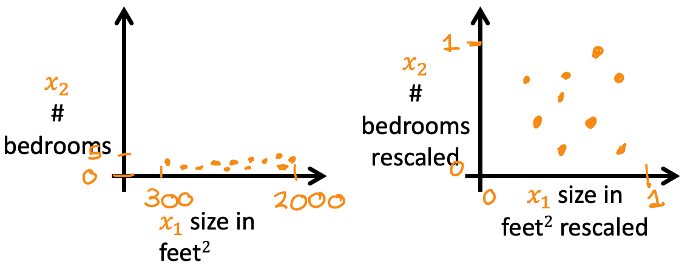
> **A. Subtract the mean (average) from each value and then divide by the (max - min)**
> This method is called Mean Normalization.

**2. Suppose a friend ran gradient descent three separate times with three choices of the learning rate α and plotted the learning curves. For which case, A or B, was the learning rate α likely too large?**
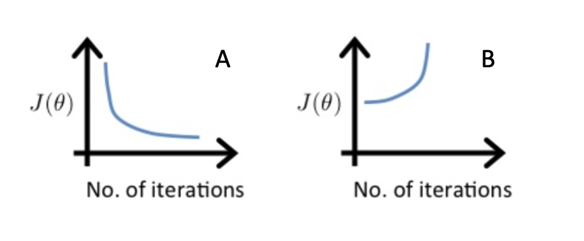
> **B. case B only**
> The cost is increasing, which indicates that gradient descent is diverging, a classic sign of a learning rate that is too large.

**3. Of the circumstances below, for which one is feature scaling particularly helpful?**
> **A. Feature scaling is helpful when one feature is much larger (or smaller) than another feature.**
> For example, "house size" in square feet (e.g., ~2000) is much larger than "number of bedrooms" (e.g., ~1-5). Scaling helps balance their influence during training.

**4. You are helping a grocery store predict its revenue and have data on its items sold per week and price per item. What could be a useful engineered feature?**
> **A. For each product, calculate the number of items sold times price per item.**
> This new feature directly represents the revenue for each product, which is likely a very strong predictor for the store's total revenue.

**5. True/False? With polynomial regression, the predicted values `f_w,b(x)` do not necessarily have to be a straight line (or linear) function of the input feature `x`.**
> **B. True**
> By creating polynomial features (like x², x³, etc.), we can model non-linear relationships, resulting in a curved prediction line.


---

## 💻 Appendix: Helper Code

### `lab_utils_multi.py`

<details>
<summary>Click to expand/collapse code</summary>

```python
import numpy as np
import copy
import math
from scipy.stats import norm
import matplotlib.pyplot as plt
from mpl_toolkits.mplot3d import axes3d
from matplotlib.ticker import MaxNLocator
dlblue = '#0096ff'; dlorange = '#FF9300'; dldarkred='#C00000'; dlmagenta='#FF40FF'; dlpurple='#7030A0'; 
plt.style.use('./deeplearning.mplstyle')

def load_data_multi():
    data = np.loadtxt("data/ex1data2.txt", delimiter=',')
    X = data[:,:2]
    y = data[:,2]
    return X, y

##########################################################
# Plotting Routines
##########################################################

def plt_house_x(X, y,f_wb=None, ax=None):
    ''' plot house with aXis '''
    if not ax:
        fig, ax = plt.subplots(1,1)
    ax.scatter(X, y, marker='x', c='r', label="Actual Value")

    ax.set_title("Housing Prices")
    ax.set_ylabel('Price (in 1000s of dollars)')
    ax.set_xlabel(f'Size (1000 sqft)')
    if f_wb is not None:
        ax.plot(X, f_wb,  c=dlblue, label="Our Prediction")
    ax.legend()
    

def mk_cost_lines(x,y,w,b, ax):
    ''' makes vertical cost lines'''
    cstr = "cost = (1/2m)*1000*("
    ctot = 0
    label = 'cost for point'
    for p in zip(x,y):
        f_wb_p = w*p[0]+b
        c_p = ((f_wb_p - p[1])**2)/2
        c_p_txt = c_p/1000
        ax.vlines(p[0], p[1],f_wb_p, lw=3, color=dlpurple, ls='dotted', label=label)
        label='' #just one
        cxy = [p[0], p[1] + (f_wb_p-p[1])/2]
        ax.annotate(f'{c_p_txt:0.0f}', xy=cxy, xycoords='data',color=dlpurple, 
            xytext=(5, 0), textcoords='offset points')
        cstr += f"{c_p_txt:0.0f} +"
        ctot += c_p
    ctot = ctot/(len(x))
    cstr = cstr[:-1] + f") = {ctot:0.0f}"
    ax.text(0.15,0.02,cstr, transform=ax.transAxes, color=dlpurple)
    
    
def inbounds(a,b,xlim,ylim):
    xlow,xhigh = xlim
    ylow,yhigh = ylim
    ax, ay = a
    bx, by = b
    if (ax > xlow and ax < xhigh) and (bx > xlow and bx < xhigh) \
        and (ay > ylow and ay < yhigh) and (by > ylow and by < yhigh):
        return(True)
    else:
        return(False)

from mpl_toolkits.mplot3d import axes3d
def plt_contour_wgrad(x, y, hist, ax, w_range=[-100, 500, 5], b_range=[-500, 500, 5], 
                contours = [0.1,50,1000,5000,10000,25000,50000], 
                      resolution=5, w_final=200, b_final=100,step=10 ):
    b0,w0 = np.meshgrid(np.arange(*b_range),np.arange(*w_range))
    z=np.zeros_like(b0)
    n,_ = w0.shape
    for i in range(w0.shape[0]):
        for j in range(w0.shape[1]):
            z[i][j] = compute_cost(x, y, w0[i][j], b0[i][j] )
   
    CS = ax.contour(w0, b0, z, contours, linewidths=2,
                   colors=[dlblue, dlorange, dldarkred, dlmagenta, dlpurple]) 
    ax.clabel(CS, inline=1, fmt='%1.0f', fontsize=10)
    ax.set_xlabel("w");  ax.set_ylabel("b")
    ax.set_title('Contour plot of cost J(w,b), vs b,w with path of gradient descent')
    w = w_final; b=b_final
    ax.hlines(b, ax.get_xlim()[0],w, lw=2, color=dlpurple, ls='dotted')
    ax.vlines(w, ax.get_ylim()[0],b, lw=2, color=dlpurple, ls='dotted')

    base = hist[0]
    for point in hist[0::step]:
        edist = np.sqrt((base[0] - point[0])**2 + (base[1] - point[1])**2)
        if(edist > resolution or point==hist[-1]):
            if inbounds(point,base, ax.get_xlim(),ax.get_ylim()):
                plt.annotate('', xy=point, xytext=base,xycoords='data',
                         arrowprops={'arrowstyle': '->', 'color': 'r', 'lw': 3},
                         va='center', ha='center')
            base=point
    return


# plots p1 vs p2. Prange is an array of entries [min, max, steps]. In feature scaling lab.
def plt_contour_multi(x, y, w, b, ax, prange, p1, p2, title="", xlabel="", ylabel=""): 
    contours = [1e2, 2e2,3e2,4e2, 5e2, 6e2, 7e2,8e2,1e3, 1.25e3,1.5e3, 1e4, 1e5, 1e6, 1e7]
    px,py = np.meshgrid(np.linspace(*(prange[p1])),np.linspace(*(prange[p2])))
    z=np.zeros_like(px)
    n,_ = px.shape
    for i in range(px.shape[0]):
        for j in range(px.shape[1]):
            w_ij = w
            b_ij = b
            if p1 <= 3: w_ij[p1] = px[i,j]
            if p1 == 4: b_ij = px[i,j]
            if p2 <= 3: w_ij[p2] = py[i,j]
            if p2 == 4: b_ij = py[i,j]
                
            z[i][j] = compute_cost(x, y, w_ij, b_ij )
    CS = ax.contour(px, py, z, contours, linewidths=2,
                   colors=[dlblue, dlorange, dldarkred, dlmagenta, dlpurple]) 
    ax.clabel(CS, inline=1, fmt='%1.2e', fontsize=10)
    ax.set_xlabel(xlabel);  ax.set_ylabel(ylabel)
    ax.set_title(title, fontsize=14)


def plt_equal_scale(X_train, X_norm, y_train):
    fig,ax = plt.subplots(1,2,figsize=(12,5))
    prange = [
              [ 0.238-0.045, 0.238+0.045,  50],
              [-25.77326319-0.045, -25.77326319+0.045, 50],
              [-50000, 0,      50],
              [-1500,  0,      50],
              [0, 200000, 50]]
    w_best = np.array([0.23844318, -25.77326319, -58.11084634,  -1.57727192])
    b_best = 235
    plt_contour_multi(X_train, y_train, w_best, b_best, ax[0], prange, 0, 1, 
                      title='Unnormalized, J(w,b), vs w[0],w[1]',
                      xlabel= "w[0] (size(sqft))", ylabel="w[1] (# bedrooms)")
    #
    w_best = np.array([111.1972, -16.75480051, -28.51530411, -37.17305735])
    b_best = 376.949151515151
    prange = [[ 111-50, 111+50,   75],
              [-16.75-50,-16.75+50, 75],
              [-28.5-8, -28.5+8,  50],
              [-37.1-16,-37.1+16, 50],
              [376-150, 376+150, 50]]
    plt_contour_multi(X_norm, y_train, w_best, b_best, ax[1], prange, 0, 1, 
                      title='Normalized, J(w,b), vs w[0],w[1]',
                      xlabel= "w[0] (normalized size(sqft))", ylabel="w[1] (normalized # bedrooms)")
    fig.suptitle("Cost contour with equal scale", fontsize=18)
    #plt.tight_layout(rect=(0,0,1.05,1.05))
    fig.tight_layout(rect=(0,0,1,0.95))
    plt.show()
    
def plt_divergence(p_hist, J_hist, x_train,y_train):

    x=np.zeros(len(p_hist))
    y=np.zeros(len(p_hist))
    v=np.zeros(len(p_hist))
    for i in range(len(p_hist)):
        x[i] = p_hist[i][0]
        y[i] = p_hist[i][1]
        v[i] = J_hist[i]

    fig = plt.figure(figsize=(12,5))
    plt.subplots_adjust( wspace=0 )
    gs = fig.add_gridspec(1, 5)
    fig.suptitle(f"Cost escalates when learning rate is too large")
    #===============
    #  First subplot
    #===============
    ax = fig.add_subplot(gs[:2], )

    # Print w vs cost to see minimum
    fix_b = 100
    w_array = np.arange(-70000, 70000, 1000)
    cost = np.zeros_like(w_array)

    for i in range(len(w_array)):
        tmp_w = w_array[i]
        cost[i] = compute_cost(x_train, y_train, tmp_w, fix_b)

    ax.plot(w_array, cost)
    ax.plot(x,v, c=dlmagenta)
    ax.set_title("Cost vs w, b set to 100")
    ax.set_ylabel('Cost')
    ax.set_xlabel('w')
    ax.xaxis.set_major_locator(MaxNLocator(2)) 

    #===============
    # Second Subplot
    #===============

    tmp_b,tmp_w = np.meshgrid(np.arange(-35000, 35000, 500),np.arange(-70000, 70000, 500))
    z=np.zeros_like(tmp_b)
    for i in range(tmp_w.shape[0]):
        for j in range(tmp_w.shape[1]):
            z[i][j] = compute_cost(x_train, y_train, tmp_w[i][j], tmp_b[i][j] )

    ax = fig.add_subplot(gs[2:], projection='3d')
    ax.plot_surface(tmp_w, tmp_b, z,  alpha=0.3, color=dlblue)
    ax.xaxis.set_major_locator(MaxNLocator(2)) 
    ax.yaxis.set_major_locator(MaxNLocator(2)) 

    ax.set_xlabel('w', fontsize=16)
    ax.set_ylabel('b', fontsize=16)
    ax.set_zlabel('\ncost', fontsize=16)
    plt.title('Cost vs (b, w)')
    # Customize the view angle 
    ax.view_init(elev=20., azim=-65)
    ax.plot(x, y, v,c=dlmagenta)
    
    return

# draw derivative line
# y = m*(x - x1) + y1
def add_line(dj_dx, x1, y1, d, ax):
    x = np.linspace(x1-d, x1+d,50)
    y = dj_dx*(x - x1) + y1
    ax.scatter(x1, y1, color=dlblue, s=50)
    ax.plot(x, y, '--', c=dldarkred,zorder=10, linewidth = 1)
    xoff = 30 if x1 == 200 else 10
    ax.annotate(r"$\frac{\partial J}{\partial w}$ =%d" % dj_dx, fontsize=14,
                xy=(x1, y1), xycoords='data',
            xytext=(xoff, 10), textcoords='offset points',
            arrowprops=dict(arrowstyle="->"),
            horizontalalignment='left', verticalalignment='top')

def plt_gradients(x_train,y_train, f_compute_cost, f_compute_gradient):
    #===============
    #  First subplot
    #===============
    fig,ax = plt.subplots(1,2,figsize=(12,4))

    # Print w vs cost to see minimum
    fix_b = 100
    w_array = np.linspace(-100, 500, 50)
    w_array = np.linspace(0, 400, 50)
    cost = np.zeros_like(w_array)

    for i in range(len(w_array)):
        tmp_w = w_array[i]
        cost[i] = f_compute_cost(x_train, y_train, tmp_w, fix_b)
    ax[0].plot(w_array, cost,linewidth=1)
    ax[0].set_title("Cost vs w, with gradient; b set to 100")
    ax[0].set_ylabel('Cost')
    ax[0].set_xlabel('w')

    # plot lines for fixed b=100
    for tmp_w in [100,200,300]:
        fix_b = 100
        dj_dw,dj_db = f_compute_gradient(x_train, y_train, tmp_w, fix_b )
        j = f_compute_cost(x_train, y_train, tmp_w, fix_b)
        add_line(dj_dw, tmp_w, j, 30, ax[0])

    #===============
    # Second Subplot
    #===============

    tmp_b,tmp_w = np.meshgrid(np.linspace(-200, 200, 10), np.linspace(-100, 600, 10))
    U = np.zeros_like(tmp_w)
    V = np.zeros_like(tmp_b)
    for i in range(tmp_w.shape[0]):
        for j in range(tmp_w.shape[1]):
            U[i][j], V[i][j] = f_compute_gradient(x_train, y_train, tmp_w[i][j], tmp_b[i][j] )
    X = tmp_w
    Y = tmp_b
    n=-2
    color_array = np.sqrt(((V-n)/2)**2 + ((U-n)/2)**2)

    ax[1].set_title('Gradient shown in quiver plot')
    Q = ax[1].quiver(X, Y, U, V, color_array, units='width', )
    qk = ax[1].quiverkey(Q, 0.9, 0.9, 2, r'$2 \frac{m}{s}$', labelpos='E',coordinates='figure')
    ax[1].set_xlabel("w"); ax[1].set_ylabel("b")

def norm_plot(ax, data):
    scale = (np.max(data) - np.min(data))*0.2
    x = np.linspace(np.min(data)-scale,np.max(data)+scale,50)
    _,bins, _ = ax.hist(data, x, color="xkcd:azure")
    #ax.set_ylabel("Count")
    
    mu = np.mean(data); 
    std = np.std(data); 
    dist = norm.pdf(bins, loc=mu, scale = std)
    
    axr = ax.twinx()
    axr.plot(bins,dist, color = "orangered", lw=2)
    axr.set_ylim(bottom=0)
    axr.axis('off')
    
def plot_cost_i_w(X,y,hist):
    ws = np.array([ p[0] for p in hist["params"]])
    rng = max(abs(ws[:,0].min()),abs(ws[:,0].max()))
    wr = np.linspace(-rng+0.27,rng+0.27,20)
    cst = [compute_cost(X,y,np.array([wr[i],-32, -67, -1.46]), 221) for i in range(len(wr))]

    fig,ax = plt.subplots(1,2,figsize=(12,3))
    ax[0].plot(hist["iter"], (hist["cost"]));  ax[0].set_title("Cost vs Iteration")
    ax[0].set_xlabel("iteration"); ax[0].set_ylabel("Cost")
    ax[1].plot(wr, cst); ax[1].set_title("Cost vs w[0]")
    ax[1].set_xlabel("w[0]"); ax[1].set_ylabel("Cost")
    ax[1].plot(ws[:,0],hist["cost"])
    plt.show()

 
##########################################################
# Regression Routines
##########################################################

def compute_gradient_matrix(X, y, w, b): 
    """
    Computes the gradient for linear regression 
 
    Args:
      X : (array_like Shape (m,n)) variable such as house size 
      y : (array_like Shape (m,1)) actual value 
      w : (array_like Shape (n,1)) Values of parameters of the model      
      b : (scalar )                Values of parameter of the model      
    Returns
      dj_dw: (array_like Shape (n,1)) The gradient of the cost w.r.t. the parameters w. 
      dj_db: (scalar)                The gradient of the cost w.r.t. the parameter b. 
                                  
    """
    m,n = X.shape
    f_wb = X @ w + b              
    e   = f_wb - y                
    dj_dw  = (1/m) * (X.T @ e)    
    dj_db  = (1/m) * np.sum(e)    
        
    return dj_db,dj_dw

#Function to calculate the cost
def compute_cost_matrix(X, y, w, b, verbose=False):
    """
    Computes the gradient for linear regression 
     Args:
      X : (array_like Shape (m,n)) variable such as house size 
      y : (array_like Shape (m,)) actual value 
      w : (array_like Shape (n,)) parameters of the model 
      b : (scalar               ) parameter of the model 
      verbose : (Boolean) If true, print out intermediate value f_wb
    Returns
      cost: (scalar)                      
    """ 
    m,n = X.shape

    # calculate f_wb for all examples.
    f_wb = X @ w + b  
    # calculate cost
    total_cost = (1/(2*m)) * np.sum((f_wb-y)**2)

    if verbose: print("f_wb:")
    if verbose: print(f_wb)
        
    return total_cost

# Loop version of multi-variable compute_cost
def compute_cost(X, y, w, b): 
    """
    compute cost
    Args:
      X : (ndarray): Shape (m,n) matrix of examples with multiple features
      w : (ndarray): Shape (n)   parameters for prediction   
      b : (scalar):              parameter  for prediction   
    Returns
      cost: (scalar)             cost
    """
    m = X.shape[0]
    cost = 0.0
    for i in range(m):                                
        f_wb_i = np.dot(X[i],w) + b       
        cost = cost + (f_wb_i - y[i])**2              
    cost = cost/(2*m)                                 
    return(np.squeeze(cost)) 

def compute_gradient(X, y, w, b): 
    """
    Computes the gradient for linear regression 
    Args:
      X : (ndarray Shape (m,n)) matrix of examples 
      y : (ndarray Shape (m,))  target value of each example
      w : (ndarray Shape (n,))  parameters of the model      
      b : (scalar)              parameter of the model      
    Returns
      dj_dw : (ndarray Shape (n,)) The gradient of the cost w.r.t. the parameters w. 
      dj_db : (scalar)             The gradient of the cost w.r.t. the parameter b. 
    """
    m,n = X.shape           #(number of examples, number of features)
    dj_dw = np.zeros((n,))
    dj_db = 0.

    for i in range(m):                             
        err = (np.dot(X[i], w) + b) - y[i]   
        for j in range(n):                         
            dj_dw[j] = dj_dw[j] + err * X[i,j]    
        dj_db = dj_db + err                        
    dj_dw = dj_dw/m                                
    dj_db = dj_db/m                                
        
    return dj_db,dj_dw

#This version saves more values and is more verbose than the assigment versons
def gradient_descent_houses(X, y, w_in, b_in, cost_function, gradient_function, alpha, num_iters): 
    """
    Performs batch gradient descent to learn theta. Updates theta by taking 
    num_iters gradient steps with learning rate alpha
    
    Args:
      X : (array_like Shape (m,n)    matrix of examples 
      y : (array_like Shape (m,))    target value of each example
      w_in : (array_like Shape (n,)) Initial values of parameters of the model
      b_in : (scalar)                Initial value of parameter of the model
      cost_function: function to compute cost
      gradient_function: function to compute the gradient
      alpha : (float) Learning rate
      num_iters : (int) number of iterations to run gradient descent
    Returns
      w : (array_like Shape (n,)) Updated values of parameters of the model after
          running gradient descent
      b : (scalar)                Updated value of parameter of the model after
          running gradient descent
    """
    
    # number of training examples
    m = len(X)
    
    # An array to store values at each iteration primarily for graphing later
    hist={}
    hist["cost"] = []; hist["params"] = []; hist["grads"]=[]; hist["iter"]=[];
    
    w = copy.deepcopy(w_in)  #avoid modifying global w within function
    b = b_in
    save_interval = np.ceil(num_iters/10000) # prevent resource exhaustion for long runs

    print(f"Iteration Cost          w0       w1       w2       w3       b       djdw0    djdw1    djdw2    djdw3    djdb  ")
    print(f"---------------------|--------|--------|--------|--------|--------|--------|--------|--------|--------|--------|")

    for i in range(num_iters):

        # Calculate the gradient and update the parameters
        dj_db,dj_dw = gradient_function(X, y, w, b)   

        # Update Parameters using w, b, alpha and gradient
        w = w - alpha * dj_dw               
        b = b - alpha * dj_db               
      
        # Save cost J,w,b at each save interval for graphing
        if i == 0 or i % save_interval == 0:     
            hist["cost"].append(cost_function(X, y, w, b))
            hist["params"].append([w,b])
            hist["grads"].append([dj_dw,dj_db])
            hist["iter"].append(i)

        # Print cost every at intervals 10 times or as many iterations if < 10
        if i% math.ceil(num_iters/10) == 0:
            #print(f"Iteration {i:4d}: Cost {cost_function(X, y, w, b):8.2f}   ")
            cst = cost_function(X, y, w, b)
            print(f"{i:9d} {cst:0.5e} {w[0]: 0.1e} {w[1]: 0.1e} {w[2]: 0.1e} {w[3]: 0.1e} {b: 0.1e} {dj_dw[0]: 0.1e} {dj_dw[1]: 0.1e} {dj_dw[2]: 0.1e} {dj_dw[3]: 0.1e} {dj_db: 0.1e}")
       
    return w, b, hist #return w,b and history for graphing

def run_gradient_descent(X,y,iterations=1000, alpha = 1e-6):

    m,n = X.shape
    # initialize parameters
    initial_w = np.zeros(n)
    initial_b = 0
    # run gradient descent
    w_out, b_out, hist_out = gradient_descent_houses(X ,y, initial_w, initial_b,
                                               compute_cost, compute_gradient_matrix, alpha, iterations)
    print(f"w,b found by gradient descent: w: {w_out}, b: {b_out:0.2f}")
    
    return(w_out, b_out, hist_out)

# compact extaction of hist data
#x = hist["iter"]
#J  = np.array([ p    for p in hist["cost"]])
#ws = np.array([ p[0] for p in hist["params"]])
#dj_ws = np.array([ p[0] for p in hist["grads"]])

#bs = np.array([ p[1] for p in hist["params"]]) 

def run_gradient_descent_feng(X,y,iterations=1000, alpha = 1e-6):
    m,n = X.shape
    # initialize parameters
    initial_w = np.zeros(n)
    initial_b = 0
    # run gradient descent
    w_out, b_out, hist_out = gradient_descent(X ,y, initial_w, initial_b,
                                               compute_cost, compute_gradient_matrix, alpha, iterations)
    print(f"w,b found by gradient descent: w: {w_out}, b: {b_out:0.4f}")
    
    return(w_out, b_out)

def gradient_descent(X, y, w_in, b_in, cost_function, gradient_function, alpha, num_iters): 
    """
    Performs batch gradient descent to learn theta. Updates theta by taking 
    num_iters gradient steps with learning rate alpha
    
    Args:
      X : (array_like Shape (m,n)    matrix of examples 
      y : (array_like Shape (m,))    target value of each example
      w_in : (array_like Shape (n,)) Initial values of parameters of the model
      b_in : (scalar)                Initial value of parameter of the model
      cost_function: function to compute cost
      gradient_function: function to compute the gradient
      alpha : (float) Learning rate
      num_iters : (int) number of iterations to run gradient descent
    Returns
      w : (array_like Shape (n,)) Updated values of parameters of the model after
          running gradient descent
      b : (scalar)                Updated value of parameter of the model after
          running gradient descent
    """
    
    # number of training examples
    m = len(X)
    
    # An array to store values at each iteration primarily for graphing later
    hist={}
    hist["cost"] = []; hist["params"] = []; hist["grads"]=[]; hist["iter"]=[];
    
    w = copy.deepcopy(w_in)  #avoid modifying global w within function
    b = b_in
    save_interval = np.ceil(num_iters/10000) # prevent resource exhaustion for long runs

    for i in range(num_iters):

        # Calculate the gradient and update the parameters
        dj_db,dj_dw = gradient_function(X, y, w, b)   

        # Update Parameters using w, b, alpha and gradient
        w = w - alpha * dj_dw               
        b = b - alpha * dj_db               
      
        # Save cost J,w,b at each save interval for graphing
        if i == 0 or i % save_interval == 0:     
            hist["cost"].append(cost_function(X, y, w, b))
            hist["params"].append([w,b])
            hist["grads"].append([dj_dw,dj_db])
            hist["iter"].append(i)

        # Print cost every at intervals 10 times or as many iterations if < 10
        if i% math.ceil(num_iters/10) == 0:
            #print(f"Iteration {i:4d}: Cost {cost_function(X, y, w, b):8.2f}   ")
            cst = cost_function(X, y, w, b)
            print(f"Iteration {i:9d}, Cost: {cst:0.5e}")
    return w, b, hist #return w,b and history for graphing

def load_house_data():
    data = np.loadtxt("./data/houses.txt", delimiter=',', skiprows=1)
    X = data[:,:4]
    y = data[:,4]
    return X, y

def zscore_normalize_features(X,rtn_ms=False):
    """
    returns z-score normalized X by column
    Args:
      X : (numpy array (m,n)) 
    Returns
      X_norm: (numpy array (m,n)) input normalized by column
    """
    mu     = np.mean(X,axis=0)  
    sigma  = np.std(X,axis=0)
    X_norm = (X - mu)/sigma      

    if rtn_ms:
        return(X_norm, mu, sigma)
    else:
        return(X_norm)
```

</details>

### `lab_utils_common.py`
<details>
<summary>Click to expand/collapse code</summary>

```python
""" 
lab_utils_common.py
    functions common to all optional labs, Course 1, Week 2 
"""

import numpy as np
import matplotlib.pyplot as plt

plt.style.use('./deeplearning.mplstyle')
dlblue = '#0096ff'; dlorange = '#FF9300'; dldarkred='#C00000'; dlmagenta='#FF40FF'; dlpurple='#7030A0';
dlcolors = [dlblue, dlorange, dldarkred, dlmagenta, dlpurple]
dlc = dict(dlblue = '#0096ff', dlorange = '#FF9300', dldarkred='#C00000', dlmagenta='#FF40FF', dlpurple='#7030A0')


##########################################################
# Regression Routines
##########################################################

#Function to calculate the cost
def compute_cost_matrix(X, y, w, b, verbose=False):
    """
    Computes the gradient for linear regression
     Args:
      X (ndarray (m,n)): Data, m examples with n features
      y (ndarray (m,)) : target values
      w (ndarray (n,)) : model parameters  
      b (scalar)       : model parameter
      verbose : (Boolean) If true, print out intermediate value f_wb
    Returns
      cost: (scalar)
    """
    m = X.shape[0]

    # calculate f_wb for all examples.
    f_wb = X @ w + b
    # calculate cost
    total_cost = (1/(2*m)) * np.sum((f_wb-y)**2)

    if verbose: print("f_wb:")
    if verbose: print(f_wb)

    return total_cost

def compute_gradient_matrix(X, y, w, b):
    """
    Computes the gradient for linear regression

    Args:
      X (ndarray (m,n)): Data, m examples with n features
      y (ndarray (m,)) : target values
      w (ndarray (n,)) : model parameters  
      b (scalar)       : model parameter
    Returns
      dj_dw (ndarray (n,1)): The gradient of the cost w.r.t. the parameters w.
      dj_db (scalar):        The gradient of the cost w.r.t. the parameter b.

    """
    m,n = X.shape
    f_wb = X @ w + b
    e   = f_wb - y
    dj_dw  = (1/m) * (X.T @ e)
    dj_db  = (1/m) * np.sum(e)

    return dj_db,dj_dw


# Loop version of multi-variable compute_cost
def compute_cost(X, y, w, b):
    """
    compute cost
    Args:
      X (ndarray (m,n)): Data, m examples with n features
      y (ndarray (m,)) : target values
      w (ndarray (n,)) : model parameters  
      b (scalar)       : model parameter
    Returns
      cost (scalar)    : cost
    """
    m = X.shape[0]
    cost = 0.0
    for i in range(m):
        f_wb_i = np.dot(X[i],w) + b           #(n,)(n,)=scalar
        cost = cost + (f_wb_i - y[i])**2
    cost = cost/(2*m)
    return cost 

def compute_gradient(X, y, w, b):
    """
    Computes the gradient for linear regression
    Args:
      X (ndarray (m,n)): Data, m examples with n features
      y (ndarray (m,)) : target values
      w (ndarray (n,)) : model parameters  
      b (scalar)       : model parameter
    Returns
      dj_dw (ndarray Shape (n,)): The gradient of the cost w.r.t. the parameters w.
      dj_db (scalar):             The gradient of the cost w.r.t. the parameter b.
    """
    m,n = X.shape           #(number of examples, number of features)
    dj_dw = np.zeros((n,))
    dj_db = 0.

    for i in range(m):
        err = (np.dot(X[i], w) + b) - y[i]
        for j in range(n):
            dj_dw[j] = dj_dw[j] + err * X[i,j]
        dj_db = dj_db + err
    dj_dw = dj_dw/m
    dj_db = dj_db/m

    return dj_db,dj_dw
```

</details>


### `deeplearning.mplstyle`
<details>
<summary>Click to expand/collapse code</summary>

```css
# see https://matplotlib.org/stable/tutorials/introductory/customizing.html
lines.linewidth: 4
lines.solid_capstyle: butt

legend.fancybox: true

# Verdana" for non-math text,
# Cambria Math

#Blue (Crayon-Aqua) 0096FF
#Dark Red C00000
#Orange (Apple Orange) FF9300
#Black 000000
#Magenta FF40FF
#Purple 7030A0

axes.prop_cycle: cycler('color', ['0096FF', 'FF9300', 'FF40FF', '7030A0', 'C00000'])
#axes.facecolor: f0f0f0 # grey
axes.facecolor: ffffff  # white
axes.labelsize: large
axes.axisbelow: true
axes.grid: False
axes.edgecolor: f0f0f0
axes.linewidth: 3.0
axes.titlesize: x-large

patch.edgecolor: f0f0f0
patch.linewidth: 0.5

svg.fonttype: path

grid.linestyle: -
grid.linewidth: 1.0
grid.color: cbcbcb

xtick.major.size: 0
xtick.minor.size: 0
ytick.major.size: 0
ytick.minor.size: 0

savefig.edgecolor: f0f0f0
savefig.facecolor: f0f0f0

#figure.subplot.left: 0.08
#figure.subplot.right: 0.95
#figure.subplot.bottom: 0.07

#figure.facecolor: f0f0f0  # grey
figure.facecolor: ffffff  # white

## ***************************************************************************
## * FONT                                                                    *
## ***************************************************************************
## The font properties used by `text.Text`.
## See https://matplotlib.org/api/font_manager_api.html for more information
## on font properties.  The 6 font properties used for font matching are
## given below with their default values.
##
## The font.family property can take either a concrete font name (not supported
## when rendering text with usetex), or one of the following five generic
## values:
##     - 'serif' (e.g., Times),
##     - 'sans-serif' (e.g., Helvetica),
##     - 'cursive' (e.g., Zapf-Chancery),
##     - 'fantasy' (e.g., Western), and
##     - 'monospace' (e.g., Courier).
## Each of these values has a corresponding default list of font names
## (font.serif, etc.); the first available font in the list is used.  Note that
## for font.serif, font.sans-serif, and font.monospace, the first element of
## the list (a DejaVu font) will always be used because DejaVu is shipped with
## Matplotlib and is thus guaranteed to be available; the other entries are
## left as examples of other possible values.
##
## The font.style property has three values: normal (or roman), italic
## or oblique.  The oblique style will be used for italic, if it is not
## present.
##
## The font.variant property has two values: normal or small-caps.  For
## TrueType fonts, which are scalable fonts, small-caps is equivalent
## to using a font size of 'smaller', or about 83%% of the current font
## size.
##
## The font.weight property has effectively 13 values: normal, bold,
## bolder, lighter, 100, 200, 300, ..., 900.  Normal is the same as
## 400, and bold is 700.  bolder and lighter are relative values with
## respect to the current weight.
##
## The font.stretch property has 11 values: ultra-condensed,
## extra-condensed, condensed, semi-condensed, normal, semi-expanded,
## expanded, extra-expanded, ultra-expanded, wider, and narrower.  This
## property is not currently implemented.
##
## The font.size property is the default font size for text, given in points.
## 10 pt is the standard value.
##
## Note that font.size controls default text sizes.  To configure
## special text sizes tick labels, axes, labels, title, etc., see the rc
## settings for axes and ticks.  Special text sizes can be defined
## relative to font.size, using the following values: xx-small, x-small,
## small, medium, large, x-large, xx-large, larger, or smaller


font.family:  sans-serif
font.style:   normal
font.variant: normal
font.weight:  normal
font.stretch: normal
font.size:    12.0

font.serif:      DejaVu Serif, Bitstream Vera Serif, Computer Modern Roman, New Century Schoolbook, Century Schoolbook L, Utopia, ITC Bookman, Bookman, Nimbus Roman No9 L, Times New Roman, Times, Palatino, Charter, serif
font.sans-serif: Verdana, DejaVu Sans, Bitstream Vera Sans, Computer Modern Sans Serif, Lucida Grande, Geneva, Lucid, Arial, Helvetica, Avant Garde, sans-serif
font.cursive:    Apple Chancery, Textile, Zapf Chancery, Sand, Script MT, Felipa, Comic Neue, Comic Sans MS, cursive
font.fantasy:    Chicago, Charcoal, Impact, Western, Humor Sans, xkcd, fantasy
font.monospace:  DejaVu Sans Mono, Bitstream Vera Sans Mono, Computer Modern Typewriter, Andale Mono, Nimbus Mono L, Courier New, Courier, Fixed, Terminal, monospace


## ***************************************************************************
## * TEXT                                                                    *
## ***************************************************************************
## The text properties used by `text.Text`.
## See https://matplotlib.org/api/artist_api.html#module-matplotlib.text
## for more information on text properties
#text.color: black
```

</details>