# 🧠 Classification with Logistic Regression

### 📚 Table of Contents
*   [Classification](#-classification)
*   [Why not Linear Regression?](#-why-not-linear-regression)
*   [Logistic Regression](#-logistic-regression)
*   [Decision Boundary](#-decision-boundary)
*   [Practice Quiz](#-practice-quiz)

---

## 📝 Classification

In machine learning, **classification** is a type of supervised learning where the output variable `y` is a category, not a continuous number. The model's goal is to predict which category a new observation belongs to.

**Examples:**
*   📧 Is this email spam? (Yes/No)
*   💳 Is the transaction fraudulent? (Yes/No)
*   🩺 Is this tumor malignant? (Yes/No)

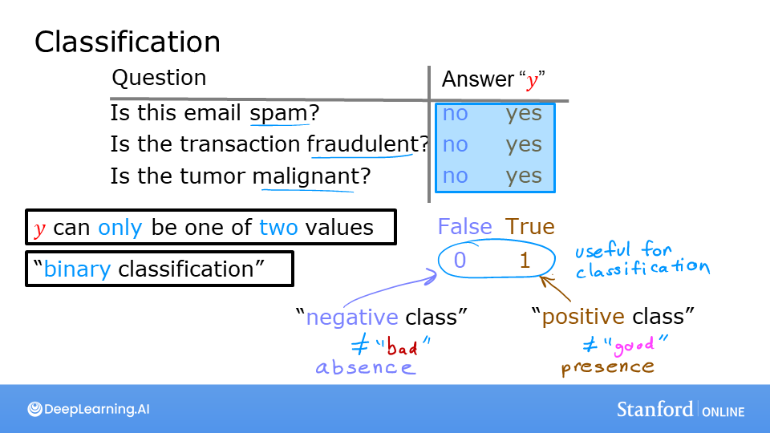

### Binary Classification
This is the simplest form of classification, where the output variable `y` can only take on one of two possible values or classes.

**Notation:**
We often use specific terms and numerical representations for these two classes:
*   **Negative Class (0):** Represents the absence of something (e.g., "no", "false", "not spam", "benign tumor").
*   **Positive Class (1):** Represents the presence of something (e.g., "yes", "true", "spam", "malignant tumor").

---

## 🤔 Why not Linear Regression?

At first glance, one might think of using linear regression for classification problems. However, it's not a suitable algorithm.

When we use linear regression, the model fits a straight line to the data. If we set a threshold (e.g., 0.5) to decide the class, it might work for a simple dataset. But, this approach is very sensitive to outliers.

If we add an outlier to the training data, the best-fit line of the linear regression model will shift significantly. This shift also moves the decision threshold, leading to misclassification of existing data points.

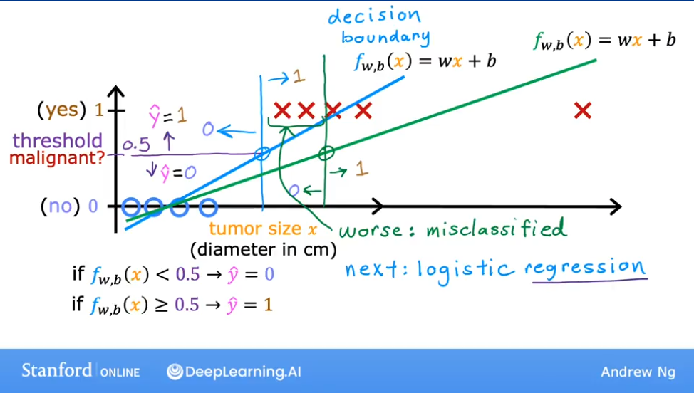
*As seen above, adding a single outlier point on the right causes the linear model's decision boundary to shift, resulting in an incorrect prediction for the point at x=3.*

<details>
<summary><b>🧪 Lab: Demonstrating the Problem with Linear Regression</b></summary>

### Goal
In this lab, you will contrast regression and classification and see why linear regression is not ideal for classification tasks.

### Code
```python
import numpy as np
%matplotlib widget
import matplotlib.pyplot as plt
from lab_utils_common import dlc, plot_data
from plt_one_addpt_onclick import plt_one_addpt_onclick
plt.style.use('./deeplearning.mplstyle')

# Example Data
x_train = np.array([0., 1, 2, 3, 4, 5])
y_train = np.array([0,  0, 0, 1, 1, 1])
X_train2 = np.array([[0.5, 1.5], [1,1], [1.5, 0.5], [3, 0.5], [2, 2], [1, 2.5]])
y_train2 = np.array([0, 0, 0, 1, 1, 1])

# Plotting the data
pos = y_train == 1
neg = y_train == 0

fig,ax = plt.subplots(1,2,figsize=(8,3))
#plot 1, single variable
ax[0].scatter(x_train[pos], y_train[pos], marker='x', s=80, c = 'red', label="y=1")
ax[0].scatter(x_train[neg], y_train[neg], marker='o', s=100, label="y=0", facecolors='none',
edgecolors=dlc["dlblue"],lw=3)

ax[0].set_ylim(-0.08,1.1)
ax[0].set_ylabel('y', fontsize=12)
ax[0].set_xlabel('x', fontsize=12)
ax[0].set_title('one variable plot')
ax[0].legend()

#plot 2, two variables
plot_data(X_train2, y_train2, ax[1])
ax[1].axis([0, 4, 0, 4])
ax[1].set_ylabel('$x_1$', fontsize=12)
ax[1].set_xlabel('$x_0$', fontsize=12)
ax[1].set_title('two variable plot')
ax[1].legend()
plt.tight_layout()
plt.show()

```

### Observations
Plots of classification data often use symbols to indicate the outcome. Here, 'X' represents the positive class (1) and 'O' represents the negative class (0).

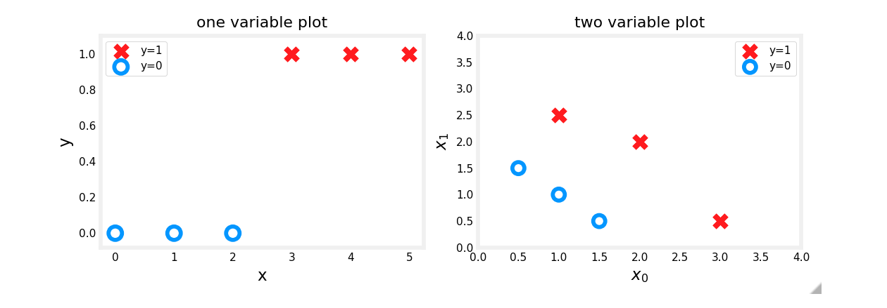

### Linear Regression Approach
Running linear regression on this data initially seems to work if we apply a 0.5 threshold. Predictions match the data.

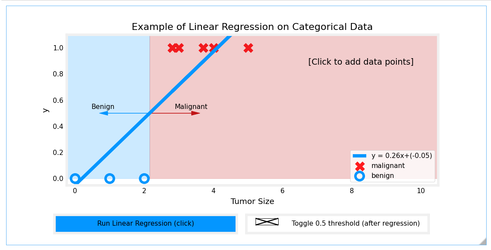

However, adding more 'malignant' data points on the far right and re-running the regression causes the model to shift. This leads to incorrect predictions for points that were previously classified correctly.

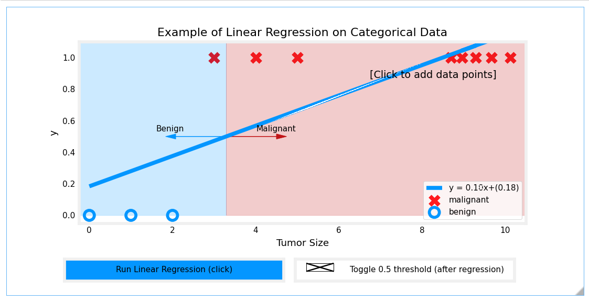

### Conclusion
This lab demonstrates that a linear model is insufficient for categorical data. We need a model better suited for classification, which brings us to Logistic Regression.

</details>

---

## 🤖 Logistic Regression

Logistic Regression is one of the most popular and widely used classification algorithms in the world. It is a go-to method for binary classification problems.

### Sigmoid Function (or Logistic Function)
The core of logistic regression is the **Sigmoid Function**, denoted as `g(z)`. This function takes any real-valued number `z` and squashes it into a value between 0 and 1.

The formula is:
`g(z) = 1 / (1 + e^(-z))`

Where `e` is Euler's number (approximately 2.718).

*   When `z` is a large positive number, `e^(-z)` is close to 0, so `g(z)` is close to **1**.
*   When `z` is a large negative number, `e^(-z)` is a very large number, so `g(z)` is close to **0**.
*   When `z = 0`, `e^0 = 1`, so `g(z)` is **0.5**.

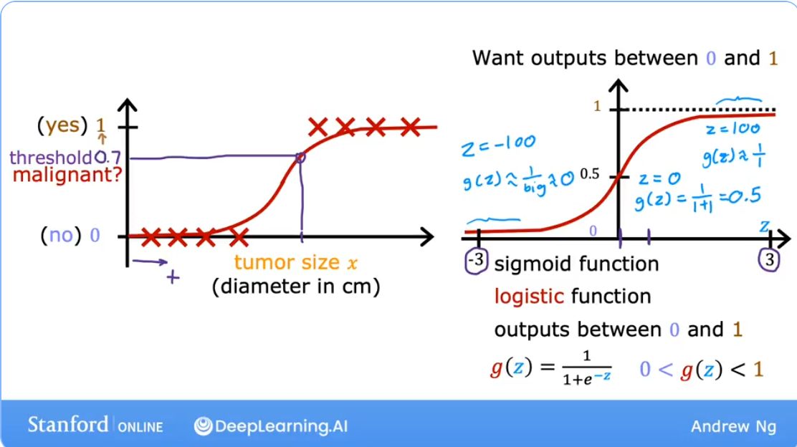

### Logistic Regression Model
The model itself combines the linear regression formula with the sigmoid function.

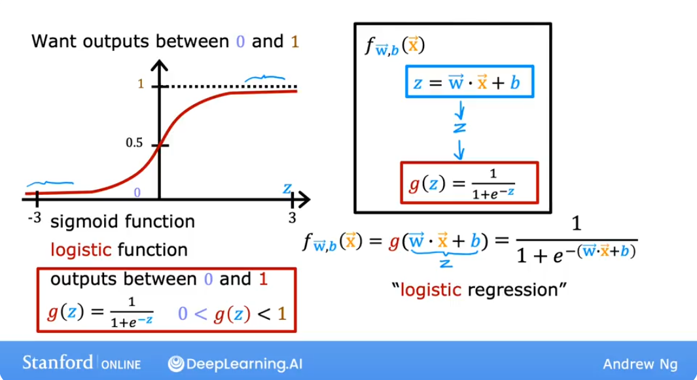

The output of this model, `f_wb(x)`, is interpreted as the probability that the output `y` is 1, given the input `x` and parameters `w` and `b`.

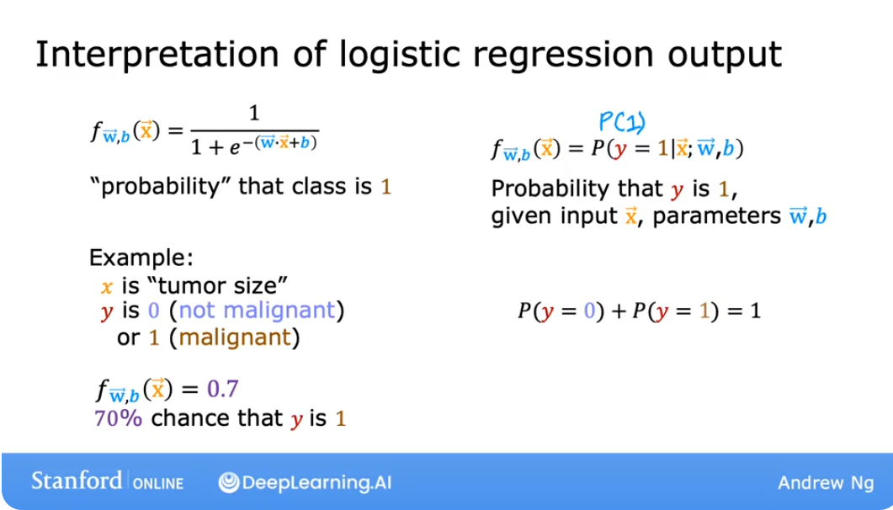

This can be written as: `f_wb(x) = P(y = 1 | x; w, b)`

> **Real-World Application:** A variation of logistic regression was a key driver behind early online advertising systems, deciding which ads to show to which users to maximize the probability of a click.

---

## Decision Boundary

The decision boundary is the line or surface that separates the different classes predicted by the model.

For logistic regression, we typically predict `y=1` if `f_wb(x) >= 0.5` and `y=0` if `f_wb(x) < 0.5`.

Since `g(z) >= 0.5` when `z >= 0`, the decision boundary corresponds to the line where `z = 0`.
`z = w · x + b = 0`

This equation defines the decision boundary.

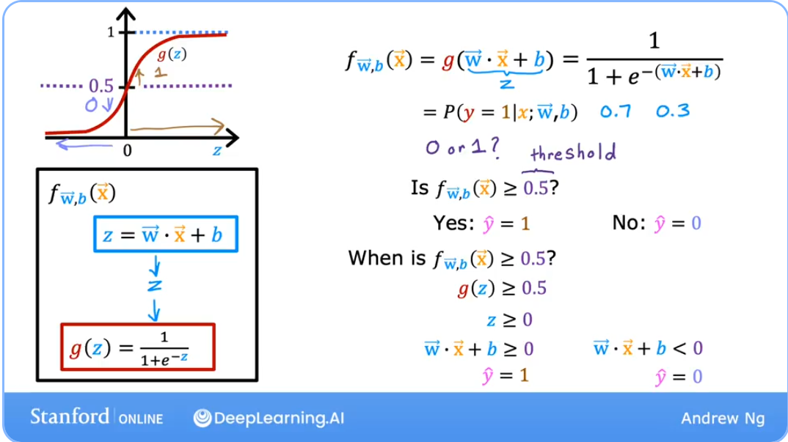

For a model with two features (`x1`, `x2`), the decision boundary is a line given by `w1*x1 + w2*x2 + b = 0`.

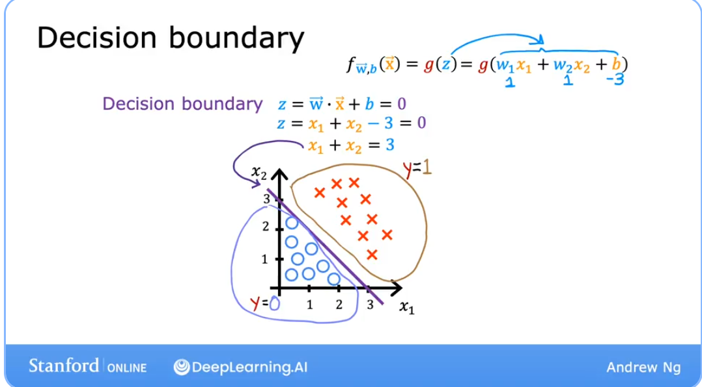

### Complex Non-Linear Decision Boundaries
Logistic regression can also model complex, non-linear relationships by using **polynomial features**. Instead of just using `x1` and `x2`, we can create new features like `x1^2`, `x2^2`, `x1*x2`, etc.

The model then becomes:
`f_wb(x) = g(w1*x1 + w2*x2 + w3*x1^2 + w4*x1*x2 + ... + b)`

By setting the argument `z` to zero, we can create more complex decision boundaries, such as circles or other curved shapes.

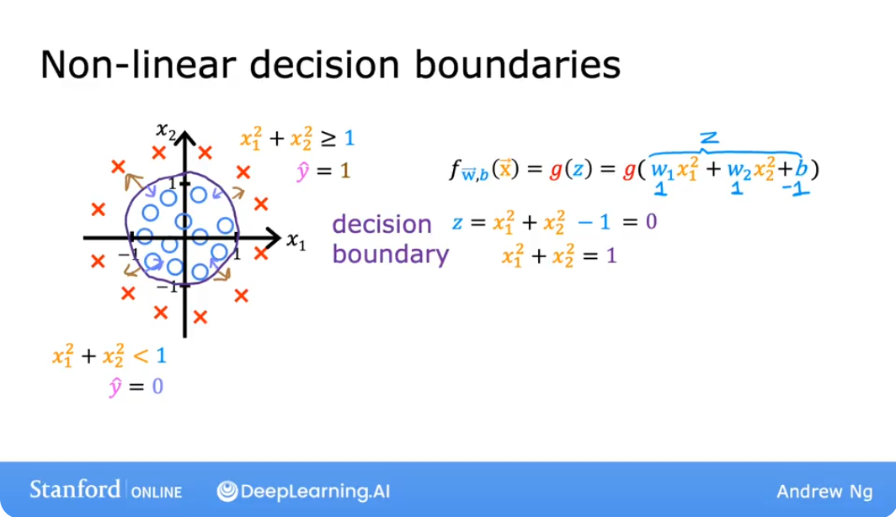

Without these higher-order polynomial features, the decision boundary for logistic regression will always be linear.


> **Question:** Let's say you are creating a tumor detection algorithm. Your algorithm will be used to flag potential tumors for future inspection by a specialist. What value should you use for a threshold?
> *   A. High, say a threshold of 0.9?
> *   B. Low, say a threshold of 0.2?
>
> **Answer:** B. You would not want to miss a potential tumor (a false negative), so you should use a low threshold. A specialist will review the output, which helps mitigate the impact of any false positives. This highlights that the threshold does not always have to be 0.5.

<details>
<summary><b>🧪 Lab: Logistic Regression and Decision Boundaries</b></summary>

### Goals
*   Explore the sigmoid function.
*   Implement and visualize logistic regression.
*   Plot the decision boundary for a logistic regression model.

### Code: Sigmoid Function
The `numpy.exp()` function is used to compute `e^z`.

```python
import numpy as np
%matplotlib widget
import matplotlib.pyplot as plt
from lab_utils_common import plot_data, sigmoid, draw_vthresh
plt.style.use('./deeplearning.mplstyle')

# np.exp() example
input_array = np.array([1, 2, 3])
exp_array = np.exp(input_array)
print("Input to exp:", input_array)
print("Output of exp:", exp_array)
# Output:
# Input to exp: [1 2 3]
# Output of exp: [ 2.718  7.389 20.086]

# Sigmoid function implementation
def sigmoid(z):
    """
    Compute the sigmoid of z
    Args:
        z (ndarray): A scalar, numpy array of any size.
    Returns:
        g (ndarray): sigmoid(z), with the same shape as z
    """
    g = 1/(1+np.exp(-z))
    return g

# Generate values and apply sigmoid
z_tmp = np.arange(-10, 11)
y = sigmoid(z_tmp)
np.set_printoptions(precision=3)
print("Input (z), Output (sigmoid(z))")
print(np.c_[z_tmp, y])

# Plotting the sigmoid function
fig,ax = plt.subplots(1,1,figsize=(5,3))
ax.plot(z_tmp, y, c="b")
ax.set_title("Sigmoid function")
ax.set_ylabel('sigmoid(z)')
ax.set_xlabel('z')
draw_vthresh(ax,0)
```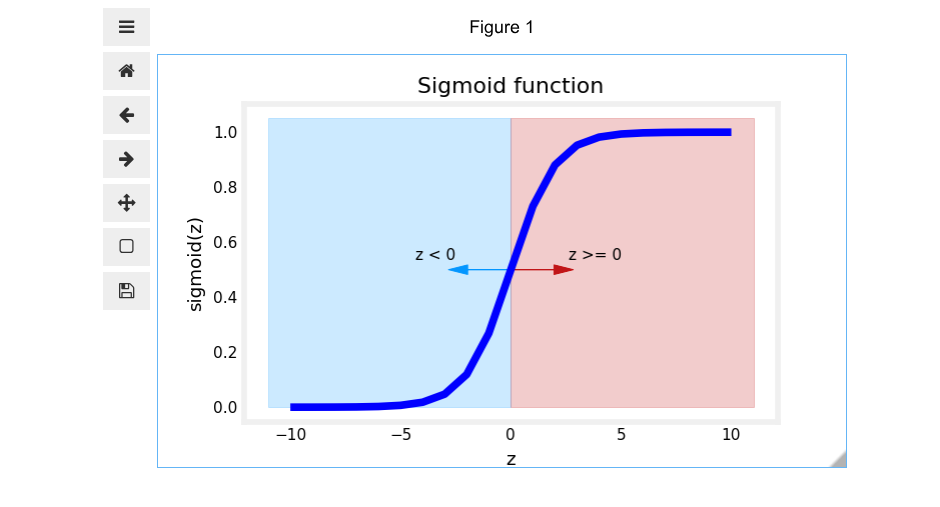

### Code: Applying Logistic Regression to Data
Unlike the linear model, the logistic regression model handles outliers well and continues to make correct predictions even after adding more data points to the far right.

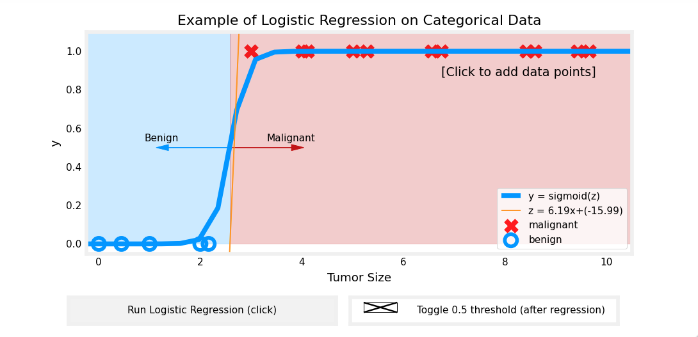

### Code: Plotting the Decision Boundary
Here we use a dataset with two features to visualize the decision boundary.

```python
# Dataset
X = np.array([[0.5, 1.5], [1,1], [1.5, 0.5], [3, 0.5], [2, 2], [1, 2.5]])
y = np.array([0, 0, 0, 1, 1, 1]).reshape(-1,1)

# Plotting the data
fig,ax = plt.subplots(1,1,figsize=(4,4))
plot_data(X, y, ax)

ax.axis([0, 4, 0, 3.5])
ax.set_ylabel('$x_1$')
ax.set_xlabel('$x_0$')
plt.show()
```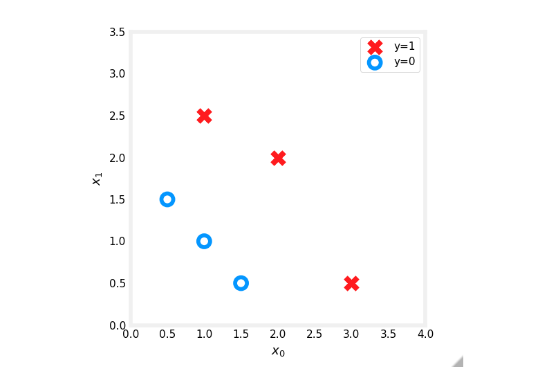

The logistic regression model will find parameters `w` and `b` that define a linear decision boundary separating the red 'X's from the blue 'O's.

```
</details>

---
## ✅ Practice Quiz

**Question 1:**
Which is an example of a classification task?
*   A. Based on a patient's age and blood pressure, determine how much blood pressure medication (measured in milligrams) the patient should be prescribed.
*   B. Based on a patient's blood pressure, determine how much blood pressure medication (a dosage measured in milligrams) the patient should be prescribed.
*   C. Based on the size of each tumor, determine if each tumor is malignant (cancerous) or not.

> **Answer:** C. This task predicts one of two classes, malignant or not malignant. The other options are regression tasks as they predict a continuous value (milligrams).

**Question 2:**
Recall the sigmoid function is `g(z) = 1 / (1 + e^(-z))`. If `z` is a large positive number, what is `g(z)`?
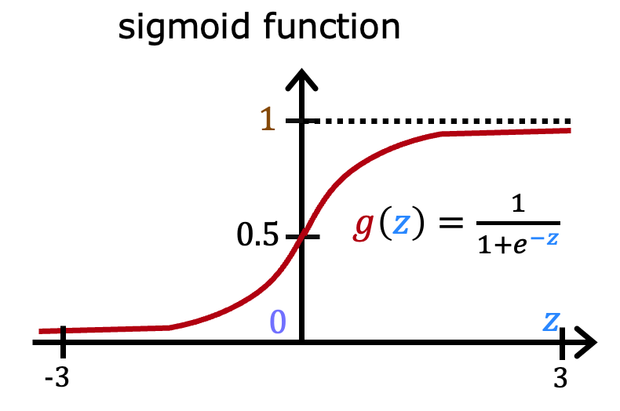
*   A. `g(z)` will be near 0.5
*   B. `g(z)` will be near zero (0)
*   C. `g(z)` is near one (1)
*   D. `g(z)` is near negative one (-1)

> **Answer:** C. If `z` is a large positive number (e.g., 100), `e^(-z)` becomes a very small positive number (close to 0). So, `g(z)` ≈ 1 / (1 + 0), which is 1.

**Question 3:**
A cat photo classification model predicts 1 if it's a cat, and 0 if it's not. For a particular photo, the logistic regression model outputs `g(z)`. Which of these would be a reasonable criterion to predict if it's a cat?
*   A. Predict it is a cat if `g(z) < 0.7`
*   B. Predict it is a cat if `g(z) < 0.5`
*   C. Predict it is a cat if `g(z) >= 0.5`
*   D. Predict it is a cat if `g(z) = 0.5`

> **Answer:** C. We interpret `g(z)` as the probability that the photo is of a cat. A standard approach is to predict "cat" when this probability is greater than or equal to a 0.5 threshold.

**Question 4:**
**True/False:** No matter what features you use (including if you use polynomial features), the decision boundary learned by logistic regression will be a linear decision boundary.
*   A. True
*   B. False

> **Answer:** B. False. As explained in the "Non-Linear Decision Boundaries" section, using polynomial features allows logistic regression to learn complex, non-linear decision boundaries.
