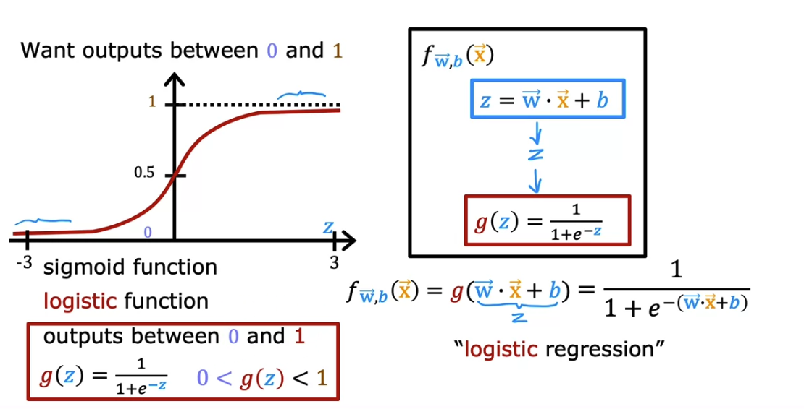
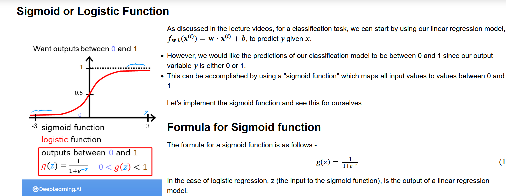
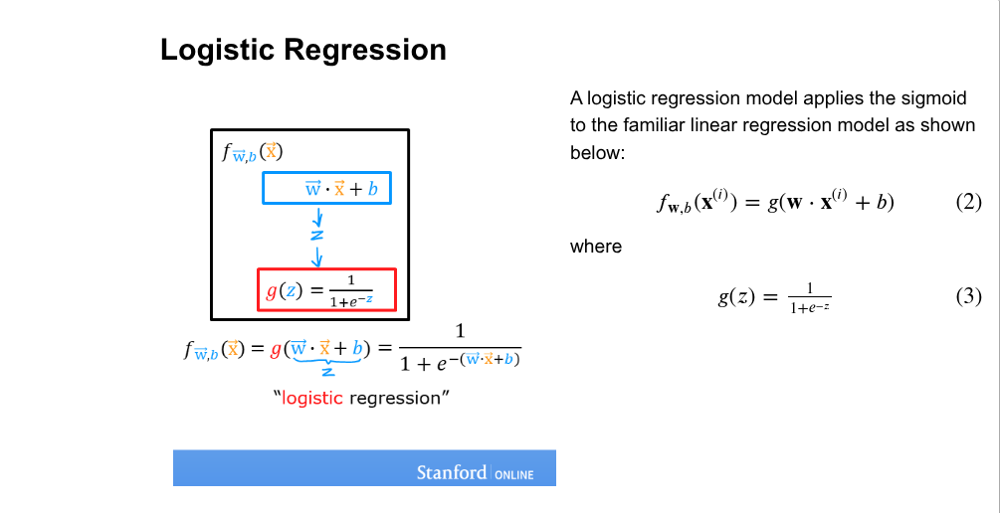
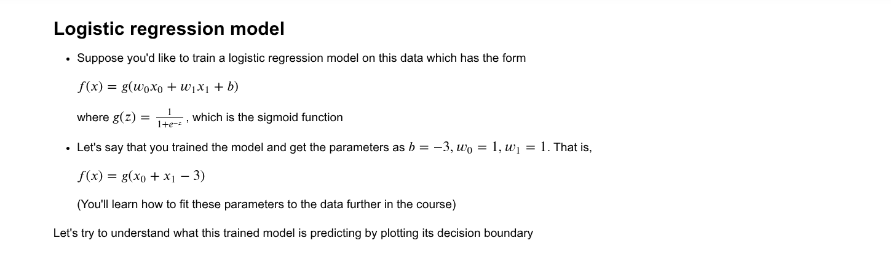
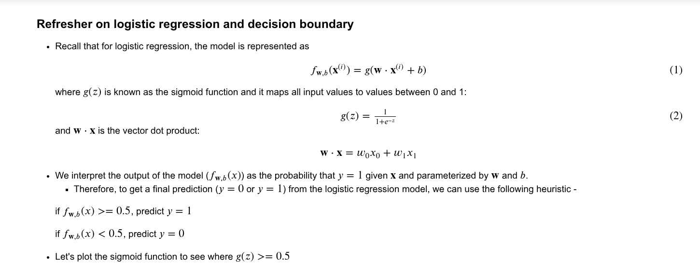

// Classification

Output variable takes only one out of a handful of possible values.

Examples: Say answer is "y", so "y" can take either of two values "no" or "yes"
1. Is this email spam? 
Answer: no, yes
2. Is the transaction fraudulent?
Answer: no, yes
3. Is this tumor malignant?
Answer: no, yes

Binary Classification
Only two possible classes or categories to classify into.

Notation:
Negative Class:
no, false, 0

Positive Class:
yes, true, 1 

Linear Regression is not a good algorithm for classification

After adding an outlier training example to the dataset we set the threshold to 0.5.

Linear Regression causes the best fit line to shift over, thus causing the dividing line (decision boundary) to shift over to the right hence causing it to mis-classify examples.

// Lab
// Classification

Goal
In this lab, you will contrast regression and classification.

import numpy as np
%matplotlib widget
import matplotlib.pyplot as plt
from lab_utils_common import dlc, plot_data
from plt_one_addpt_onclick import plt_one_addpt_onclick
plt.style.use('./deeplearning.mplstyle')  

Examples of classification problems are things like: identifying email as Spam or Not Spam or determining if a tumor is malignant or benign. In particular, these are examples of binary classification where there are two possible outcomes. Outcomes can be described in pairs of 'positive'/'negative' such as 'yes'/'no, 'true'/'false' or '1'/'0'.  

Plots of classification data sets often use symbols to indicate the outcome of an example. In the plots below, 'X' is used to represent the positive values while 'O' represents negative outcomes.  

x_train = np.array([0., 1, 2, 3, 4, 5])
y_train = np.array([0,  0, 0, 1, 1, 1])
X_train2 = np.array([[0.5, 1.5], [1,1], [1.5, 0.5], [3, 0.5], [2, 2], [1, 2.5]])
y_train2 = np.array([0, 0, 0, 1, 1, 1])  

pos = y_train == 1
neg = y_train == 0

fig,ax = plt.subplots(1,2,figsize=(8,3))
#plot 1, single variable
ax[0].scatter(x_train[pos], y_train[pos], marker='x', s=80, c = 'red', label="y=1")
ax[0].scatter(x_train[neg], y_train[neg], marker='o', s=100, label="y=0", facecolors='none', 
              edgecolors=dlc["dlblue"],lw=3)

ax[0].set_ylim(-0.08,1.1)
ax[0].set_ylabel('y', fontsize=12)
ax[0].set_xlabel('x', fontsize=12)
ax[0].set_title('one variable plot')
ax[0].legend()

#plot 2, two variables
plot_data(X_train2, y_train2, ax[1])
ax[1].axis([0, 4, 0, 4])
ax[1].set_ylabel('$x_1$', fontsize=12)
ax[1].set_xlabel('$x_0$', fontsize=12)
ax[1].set_title('two variable plot')
ax[1].legend()
plt.tight_layout()
plt.show()  

Note in the plots above:

In the single variable plot, positive results are shown both a red 'X's and as y=1. Negative results are blue 'O's and are located at y=0.

Recall in the case of linear regression, y would not have been limited to two values but could have been any value.

In the two-variable plot, the y axis is not available. Positive results are shown as red 'X's, while negative results use the blue 'O' symbol.

Recall in the case of linear regression with multiple variables, y would not have been limited to two values and a similar plot would have been three-dimensional.

// Linear Regression approach

In the previous week, you applied linear regression to build a prediction model. Let's try that approach here using the simple example that was described in the lecture. The model will predict if a tumor is benign or malignant based on tumor size. Try the following:

Click on 'Run Linear Regression' to find the best linear regression model for the given data.

Note the resulting linear model does not match the data well. One option to improve the results is to apply a threshold.

Tick the box on the 'Toggle 0.5 threshold' to show the predictions if a threshold is applied.

These predictions look good, the predictions match the data

Important: Now, add further 'malignant' data points on the far right, in the large tumor size range (near 10), and re-run linear regression.

Now, the model predicts the larger tumor, but data point at x=3 is being incorrectly predicted!  

to clear/renew the plot, rerun the cell containing the plot command.  

  

If we add more malignant data points to the right then the data point at x = 3 is incorrectly classified as benign  

  

The example above demonstrates that the linear model is insufficient to model categorical data. The model can be extended as described in the following lab.  

In this lab you:

explored categorical data sets and plotting
determined that linear regression was insufficient for a classification problem.  

// Logistic Regression

Most widely used classification algorithm in the world.

Sigmoid Function

Outputs values between 0 and 1 i.e. 0 < g(z) < 1

g(z) = 1 / (1 + e^(-z))
e is 2.71 (approx)

When z is large: g(z) will be a number very close to 1  

When z is small: g(z) will be a number very close to 0  

When z = 0: g(z) will be 0.5 (y intercept)

  

Logistic Regression Model:

  

Interpretation of Logistic Regression output

  

Question:
  
Recall the sigmoid function is g(z)=1/(1+e^-z)  
  
If z is a large negative number then:  
A. g(z) is near negative one (-1)   
B. g(z) is near zero  

Answer: B. Say z = -100. Then e^100 is a really big number. So g(z) = 1/(1 + a big positive number) or about 0.  

Earlier advertising was actually driven by a variation of Logistic Regression which decided which advertisement was shown to which person.  

Lab: Logistic Regression

- explore the sigmoid function (also known as the logistic function)
- explore logistic regression; which uses the sigmoid function

import numpy as np
%matplotlib widget
import matplotlib.pyplot as plt
from plt_one_addpt_onclick import plt_one_addpt_onclick
from lab_utils_common import draw_vthresh
plt.style.use('./deeplearning.mplstyle')

// Sigmoid or Logistic Function

  

  

NumPy has a function called exp(), which offers a convenient way to calculate the exponential (𝑒^𝑧) of all elements in the input array (z).

It also works with a single number as an input, as shown below.

# Input is an array. 
input_array = np.array([1,2,3])
exp_array = np.exp(input_array)

print("Input to exp:", input_array)
print("Output of exp:", exp_array)

# Input is a single number
input_val = 1  
exp_val = np.exp(input_val)

print("Input to exp:", input_val)
print("Output of exp:", exp_val)

Output:

Input to exp: [1 2 3]
Output of exp: [ 2.72  7.39 20.09]
Input to exp: 1
Output of exp: 2.718281828459045

The sigmoid function is implemented in python as shown in the cell below.

def sigmoid(z):
    """
    Compute the sigmoid of z

    Args:
        z (ndarray): A scalar, numpy array of any size.

    Returns:
        g (ndarray): sigmoid(z), with the same shape as z
         
    """

    g = 1/(1+np.exp(-z))
   
    return g
    
    
Let's see what the output of this function is for various value of z

# Generate an array of evenly spaced values between -10 and 10
z_tmp = np.arange(-10,11)

# Use the function implemented above to get the sigmoid values
y = sigmoid(z_tmp)

# Code for pretty printing the two arrays next to each other
np.set_printoptions(precision=3) 
print("Input (z), Output (sigmoid(z))")
print(np.c_[z_tmp, y])

The values in the left column are z, and the values in the right column are sigmoid(z). As you can see, the input values to the sigmoid range from -10 to 10, and the output values range from 0 to 1. 

Now, let's try to plot this function using the matplotlib library.

# Plot z vs sigmoid(z)
fig,ax = plt.subplots(1,1,figsize=(5,3))
ax.plot(z_tmp, y, c="b")

ax.set_title("Sigmoid function")
ax.set_ylabel('sigmoid(z)')
ax.set_xlabel('z')
draw_vthresh(ax,0)

As you can see, the sigmoid function approaches 0 as z goes to large negative values and approaches 1 as z goes to large positive values.

// Logistic Regression

Let's apply logistic regression to the categorical data example of tumor classification.
First, load the examples and initial values for the parameters.

x_train = np.array([0., 1, 2, 3, 4, 5])
y_train = np.array([0,  0, 0, 1, 1, 1])

w_in = np.zeros((1))
b_in = 0

ry the following steps:

Click on 'Run Logistic Regression' to find the best logistic regression model for the given training data
Note the resulting model fits the data quite well.
Note, the orange line is '𝑧' or  𝐰⋅𝐱(𝑖)+𝑏 above. It does not match the line in a linear regression model. Further improve these results by applying a threshold.
Tick the box on the 'Toggle 0.5 threshold' to show the predictions if a threshold is applied.
These predictions look good. The predictions match the data
Now, add further data points in the large tumor size range (near 10), and re-run logistic regression.
unlike the linear regression model, this model continues to make correct predictions

// Decision Boundary

z = w.x + b
To find decision boundary set: z = 0

f_wb(x) = g(z) = g(w.x + b)

g(z) = 1 / (1 + e^-z)

So, 

f_wb(x) = 1 / (1 + e^ (-1 * (w.x + b)))

f_wb(x) = P(y = 1 | x; w, b)

This is read as, f_wb(x) is equal to the probabilty that y is equal to 1 given feature x and with parameters w and b.

f_wb(x) = g(w.x + b)  
  

f_wb(x) = g(w1.x1 + w2.x2 + b)  
  

// Complex Non Linear decision boundary  

f_wb(x) = g(w1.x1^2 + w2.x2^2 + b)  
  

// Non-Linear decision boundaries

Polynomial Features: x1^2, x2^2 etc.

f_wb(x) = g(z) = g(w1x1 + w2x2 + w3x1^2 + w4.x4x2 + w5.x2^2 + w6.x1^3 + ... + b)

If we were not to use these higher order polynomial features then the decision boundary for Logisitic Regression (with features like x1, x2, x3 etc.) would always be linear i.e. a straight line.   

  

Question:
Let's say you are creating a tumor detection algorithm. Your algorithm will be used to flag potential tumors for future inspection by a specialist. What value should you use for a threshold?

A. High, say a threshold of 0.9?
B. Low, say a threshold of 0.2?

Answer: 

B: You would not want to miss a potential tumor, so you will want a low threshold. A specialist will review the output of the algorithm which reduces the possibility of a ‘false positive’. The key point of this question is to note that the threshold value does not need to be 0.5.

Lab: 

Logistic Regression, Decision Boundary

Goals

- Plot the decision boundary for a logistic regression model. This will give you a better sense of what the model is predicting.

import numpy as np
%matplotlib widget
import matplotlib.pyplot as plt
from lab_utils_common import plot_data, sigmoid, draw_vthresh
plt.style.use('./deeplearning.mplstyle')

Dataset
Let's suppose you have following training dataset

The input variable X is a numpy array which has 6 training examples, each with two features
The output variable y is also a numpy array with 6 examples, and y is either 0 or 1

X = np.array([[0.5, 1.5], [1,1], [1.5, 0.5], [3, 0.5], [2, 2], [1, 2.5]])
y = np.array([0, 0, 0, 1, 1, 1]).reshape(-1,1) 

Plot data

Let's use a helper function to plot this data. The data points with label 𝑦=1 are shown as red crosses, while the data points with label 𝑦=0 are shown as blue circles.

fig,ax = plt.subplots(1,1,figsize=(4,4))
plot_data(X, y, ax)

ax.axis([0, 4, 0, 3.5])
ax.set_ylabel('$x_1$')
ax.set_xlabel('$x_0$')
plt.show()

Logistic Regression Model

# Plot sigmoid(z) over a range of values from -10 to 10
z = np.arange(-10,11)

fig,ax = plt.subplots(1,1,figsize=(5,3))
# Plot z vs sigmoid(z)
ax.plot(z, sigmoid(z), c="b")

ax.set_title("Sigmoid function")
ax.set_ylabel('sigmoid(z)')
ax.set_xlabel('z')
draw_vthresh(ax,0)

Practice Quiz: Classification with logistic regression

Question 1:
Which is an example of a classification task?

A. Based on a patient's age and blood pressure, determine how much blood pressure medication (measured in milligrams) the patient should be prescribed.

B. Based on a patient's blood pressure, determine how much blood pressure medication (a dosage measured in milligrams) the patient should be prescribed.

C. Based on the size of each tumor, determine if each tumor is malignant (cancerous) or not.

Answer:
C. This task predicts one of two classes, malignant or not malignant.

Question 2
Recall the sigmoid function is g(z) = 1 / (1 + (e^(-1 * (z))))

  

A. g(z) will be near 0.5
B. g(z) will be near zero (0)
C. g(z) is near one (1)
D. g(z) is near negative one (-1)

Answer:

C. Say z = +100. So e^-z, is then e^-100 a really small positive number. So, g(z)= 1 / (1 + a small +ve number) which is close to 1.

Question 3:

A cat photo classification model predicts 1 if it's a cat, and 0 if it's not a cat. For a particular photograph, the logistic regression model outputs g(z), (a number between 0 and 1). Which of these would be a reasonable criteria to decide whether to predict if it's a cat?

A. Predict it is a cat if g(z) < 0.7
B. Predict it is a cat if g(z) < 0.5
C. Predict it is a cat if g(z) >= 0.5
D. Predict it is a cat if g(z) = 0.5

Answer: 

Think of g(z) as the probability that the photo is of a cat. When this number is at or above the threshold of 0.5, predict that it is a cat.

Question 4:
True/False? No matter what features you use (including if you use polynomial features), the decision boundary learned by logistic regression will be a linear decision boundary.

A. True
B. False

Answer: B. The decision boundary can also be non-linear, as described in the lectures.

